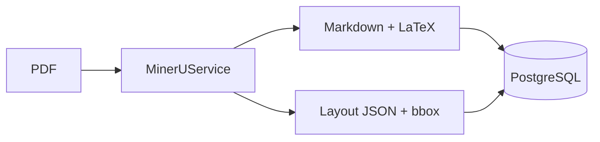

# Axiom-Flow v0.1

> QED-Engine 的核心知识解析与重构引擎 — 将数学教材转化为结构化知识网络。

## 项目定位

Axiom-Flow 是 **QED-Engine** 系列的第二部分（Part 2），负责 PDF 内容数字化与知识提取。它与 Part 1 的 **QED-Tracker**（资源检索分类引擎）协同工作：

```
QED-Tracker (Part 1)             Axiom-Flow (Part 2)
┌──────────────────┐            ┌──────────────────────┐
│  检索 + 分类 +    │──dataset──→│  MinerU 解析         │
│  元数据索引       │            │  → LlamaIndex 索引   │
│                  │            │  → Qdrant 向量存储   │
└──────────────────┘            └──────────────────────┘
```

## Phase 1：MinerU 集成（v0.1 目标）

当前阶段聚焦于 **MinerU PDF 解析管线** 的搭建，实现数学教材的完整数字化提取：

- **版面分析**：识别文本、公式、表格、标题的物理布局
- **LaTeX 提取**：高保真还原数学公式
- **坐标保留**：每字每符的 bbox 物理坐标保留
- **结构存储**：PostgreSQL 存储布局元数据



## 快速开始

```bash
# 1. 激活环境
conda activate QED_env

# 2. 安装依赖
pip install -r requirements.txt

# 3. 初始化数据库
python scripts/init_db.py

# 4. 启动服务
uvicorn app.main:app --reload --port 8002
```

## 项目结构

```
app/                          # 核心应用
├── api/                      # FastAPI 路由
├── core/                     # 配置与数据库连接
├── models/                   # 数据模型 (AxiomNode / LayoutBlock / Document)
├── repository/               # 数据访问层
├── services/                 # 业务服务 (MinerU / Parser / Index)
└── main.py                   # FastAPI 入口
docs/                         # AOP 协议文档体系
├── agents_read.md            # Agent 操作协议
├── architecture.md           # 系统架构
├── environment.md            # 环境搭建指南
├── design/                   # 设计文档
├── trackers/                 # 任务追踪
└── knowledge_base/           # 书目状态与知识依赖
data/
├── raw/                      # 原始 PDF
└── parsed/                   # MinerU 解析输出
scripts/                      # CLI 工具与批处理
```

## 技术栈

| 维度 | 选型 |
|------|------|
| 解析引擎 | MinerU (Magic-PDF) |
| 异步框架 | FastAPI |
| 关系存储 | PostgreSQL |
| 向量存储 | Qdrant |
| 知识索引 | LlamaIndex (后续 Phase) |
| 任务队列 | Redis + Celery (后续 Phase) |

## 依赖项目

- **QED-Tracker** (`../QED-Tracker/`) — 提供已检索的 PDF 数据源
- **数据路径**: `D:\coding\QED-Engine\QED-Tracker\dataset`

## AOP 协议

本项目遵循 Agentic Operations Protocol。Agent 在操作前必须阅读 `docs/agents_read.md`。

## License

MIT
