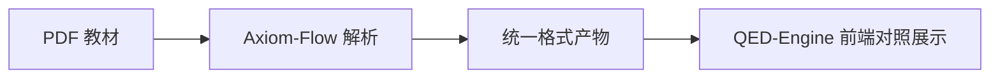

# Axiom-Flow

> 解析文档，供给渲染。

Axiom-Flow 是 QED-Engine 的**后端解析组件**：把 PDF（教材、习题集等数学文档）完整解析为统一
格式（Markdown / LaTeX / 结构化块），支撑 QED-Engine 前端做高还原对照展示。前端由 QED-Engine
负责，本仓库只保证 API 契约与产物格式稳定。项目为探索型，当前处于推倒重来后的第一轮
（v2 重建中），详见 [ADR 0001](docs/adr/0001-v2-exploration-direction.md)。

## 在 QED 中的位置


```mermaid
flowchart LR
    A[PDF 教材] --> B[Axiom-Flow 解析]
    B --> C[统一格式产物]
    C --> D[QED-Engine 前端对照展示]
```

本仓库只实现图中的 Axiom-Flow。数据集采集、前端展示和最终学习体验属于外部或后续模块。

## 核心能力

- 导入 PDF（页范围可控），以持久任务方式提交解析。
- 使用 MinerU（vlm/hybrid 后端，本地 vLLM 推理）生成页级 Markdown、LaTeX 公式、表格与结构化块。
- 页级质量信号校验，效果不达标时按页调用百炼 qwen-vl-plus 兜底。
- 产物落盘 `data/books/<book_id>/`：页图、markdown、blocks.json、state.sqlite、manifest。
- 对外 `/api/v1` 契约：书目、任务、单页数据与产物清单，供 QED-Engine 前端调用。

## 技术栈

| 范围 | 技术 |
| --- | --- |
| Backend 与协议 | Python 3.12、FastAPI、Pydantic |
| PDF 解析 | MinerU（vlm/hybrid 后端）+ vLLM（WSL Docker 容器化，GPU 穿透） |
| 兜底通道 | 阿里百炼 OCR（`qwen-vl-plus`） |
| 持久化 | 文件系统产物 + 轻量 SQLite（`state.sqlite`） |
| 部署 | WSL Ubuntu 24.04 + Docker Compose（启停脚本控制） |
| 工程门禁 | Pytest、Ruff（本地唯一门禁，无远端 CI） |

## 能力边界

| 类别 | 内容 |
| --- | --- |
| 输入 | 数学/技术 PDF（当前）、明确的页范围、解析策略（local/hybrid） |
| 核心职责 | 文档解析、统一格式产出、质量校验、兜底、任务编排 |
| 输出 | 原页高清图、页级 Markdown、结构化块（blocks.json）、可校验产物清单 |
| 不负责 | 前端展示（QED-Engine）、检索/向量化（Milvus 后续）、知识图谱（后续） |

开放工作见[待做任务](docs/trackers/todo.md)，探索方向见[路线图](docs/trackers/roadmap.md)。

## 快速启动

前置条件：Python 3.12（QED_env）、WSL Ubuntu 24.04 与 Docker。

```powershell
powershell -File scripts/infra-up.ps1        # 启动推理容器（vLLM + mineru-api）
& D:\software\anaconda3\envs\QED_env\python.exe -m pip install -e ".[dev]"
```

解析服务启动与使用方式见[开发指南](docs/guides/development.md)，容器启停与故障排查见
[操作与运维指南](docs/guides/operations.md)。

## 典型流程

1. `POST /api/v1/parse-jobs` 提交解析任务（book_id、页范围、策略）。
2. 编排层逐页调用 MinerU，质量信号校验后落盘产物。
3. 不达标页面自动走 qwen-vl-plus 兜底（hybrid 策略）。
4. QED-Engine 前端经 `/api/v1` 拉取页图与统一格式做对照展示。

## 仓库结构

| 路径 | 职责 |
| --- | --- |
| `src/axiom_flow/` | API、编排、导入、兜底与统一格式 schemas（v2 重建中） |
| `scripts/` | WSL 容器启停脚本与 compose 配置 |
| `tests/` | 单元、契约、集成与冒烟门禁 |
| `docs/` | 当前架构、设计、决策、规范、指南、计划和追踪器 |
| `data/` | 按需创建的本地解析产物，不纳入版本控制 |

## 开发入口

首次参与开发时依次阅读：

1. [AGENTS.md](AGENTS.md)：强制执行协议。
2. [文档中心](docs/index.md)：按目录定位架构、设计、计划和追踪器。
3. [系统概览](docs/architecture/overview.md)：组件和边界。
4. [开发指南](docs/guides/development.md)：环境、测试与关闭门禁。

## 文档

文档按目录导航见[文档中心](docs/index.md)；工程治理规则以 [docs/standards/](docs/standards/index.md)
为唯一事实源；未关闭任务见[待做任务](docs/trackers/todo.md)；Agent 执行协议见 [AGENTS.md](AGENTS.md)。

## License

MIT
