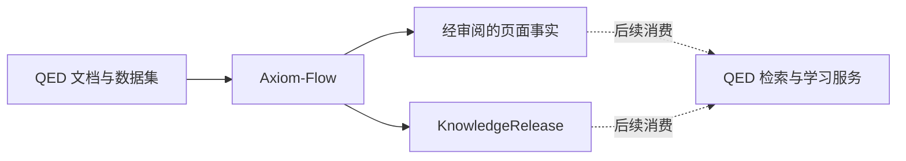

# Axiom-Flow

[](https://github.com/swfswf1234/Axiom-Flow/actions/workflows/ci.yml)

> QED 的技术 PDF 解析与质量审阅组件。

Axiom-Flow 负责把数学教材和技术文档转换为可定位、可审阅、可追溯的结构化内容。解析器和
大模型输出只作为候选结果；页面事实、知识内容和发布版本必须经过质量检查与人工确认。

## 在 QED 中的位置


```mermaid
flowchart LR
    A[QED 文档与数据集] --> B[Axiom-Flow]
    B --> C[经审阅的页面事实]
    B --> D[KnowledgeRelease]
    C -. 后续消费 .-> E[QED 检索与学习服务]
    D -. 后续消费 .-> E
```

本仓库只实现图中的 Axiom-Flow。QED 的数据集采集、检索服务和最终学习体验属于外部或后续模块。

## 核心能力

- 导入技术 PDF，并以明确的物理页范围提交持久解析任务。
- 使用 OCR 和 PDF 本地信息生成规范 Markdown、内容块、来源证据和质量报告。
- 以版本化 `ParseRun`、逐页检查点和 SHA-256 manifest 保存可恢复、可校验的解析产物。
- 在 Web 工作台中并排审阅原始页图、OCR 文本、Markdown 和结构化结果。
- 管理知识候选、关系和审阅事件，通过 Excel 工作簿形成显式 `KnowledgeRelease`。

## 技术栈

| 范围 | 技术 |
| --- | --- |
| Backend 与协议 | Python 3.12、FastAPI、Pydantic |
| 持久化与迁移 | MySQL 8、SQLAlchemy、Alembic |
| PDF 与 OCR | PyMuPDF、阿里百炼 `qwen-vl-ocr` |
| 后台任务 | MySQL 持久任务、租约与独立 Python Worker |
| 本地产物 | 内容寻址目录、逐页检查点、SHA-256 manifest |
| 审阅界面 | 原生 HTML、CSS、JavaScript、openpyxl |
| 工程门禁 | Pytest、Ruff、GitHub Actions |

## 能力边界

| 类别 | 内容 |
| --- | --- |
| 输入 | 技术 PDF、明确的页范围、解析模型与调用预算 |
| 核心职责 | PDF 导入、OCR、内容规范化、证据定位、ParseRun 管理、质量审阅和受控知识发布 |
| 输出 | 原始页图、规范 Markdown、结构化页面事实、可校验解析产物和 `KnowledgeRelease` |
| 不负责 | 数据集下载、下游检索、学习界面，以及未经人工审阅的整书质量背书 |

项目当前处于预发布工程阶段。解析链路可以运行，但数学公式 OCR 仍需真实样本评测和人工审阅；
开放工作见[待做任务](docs/trackers/todo.md)，关闭证据见[已关闭任务](docs/trackers/completed.md)，
长期方向见[能力路线图](docs/trackers/roadmap.md)。

## 快速启动

前置条件为 Python 3.12、MySQL 8，以及真实 OCR 时使用的百炼 API key。

```powershell
Copy-Item .env.example .env
python -m pip install -r requirements.txt
python -m alembic upgrade head
```

分别在两个终端启动 API/Web 和 Worker：

```powershell
python -m uvicorn backend.main:app --host 127.0.0.1 --port 8000
python -m backend.worker
```

打开 `http://127.0.0.1:8000`。开发环境和测试库隔离见[开发指南](docs/guides/development.md)，
启动检查与受保护清理见[操作与运维指南](docs/guides/operations.md)。

## 典型流程

1. 导入 PDF，并为解析任务选择明确的物理页范围。
2. Worker 生成逐页产物和不可变 manifest。
3. 在 Web 工作台中对照原始页图、OCR 文本和结构化结果。
4. 接受、拒绝或请求重新解析页面。
5. 可选生成知识候选，经工作簿审阅后显式发布 `KnowledgeRelease`。

真实解析会产生外部模型调用；没有冻结样本、预算和采纳门槛时，不应直接提交整书任务。

## 仓库结构

| 路径 | 职责 |
| --- | --- |
| `backend/` | 领域、应用、基础设施、API、Worker 和数据库迁移 |
| `web/` | 本地单页审阅工作台 |
| `evaluation/` | 模型实验 manifest、评分工具和报告 |
| `tests/` | 架构、单元、集成和工作流门禁 |
| `docs/` | 当前架构、设计、决策、规范、计划和历史资料 |
| `data/` | 本地运行数据与备份，不纳入版本控制 |

## 开发入口

首次参与开发时依次阅读：

1. [AGENTS.md](AGENTS.md)：强制执行协议。
2. [文档中心](docs/index.md)：按目录定位架构、设计、计划和历史资料。
3. [当前运行架构](docs/architecture/runtime-architecture.md)：组件和依赖边界。
4. [开发指南](docs/guides/development.md)：环境、迁移、测试与关闭门禁。

## License

MIT
