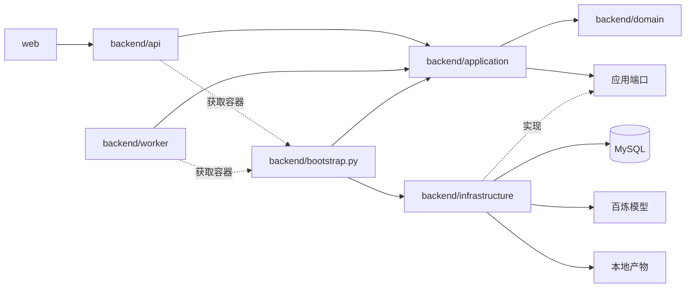
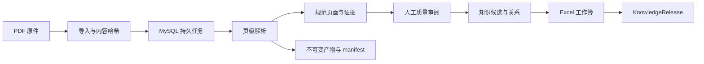
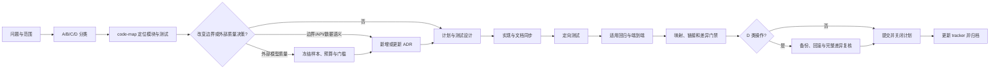

# Axiom-Flow 文档中心

状态：Current
最后更新：2026-07-29

本页面向模块开发，说明仓库结构、运行框架、主数据流和开发闭环。项目定位、能力与快速启动见
[根 README](../README.md)；Agent 执行顺序见 [AGENTS.md](../AGENTS.md)。

## 项目结构

```text
Axiom-Flow/
├── backend/
│   ├── domain/            # 领域状态、资源和错误
│   ├── application/       # 用例、策略和应用端口
│   ├── infrastructure/    # MySQL、百炼、PDF 和产物适配器
│   ├── api/               # API v1、Schema、错误翻译和静态入口
│   ├── worker/            # 持久任务领取、租约、重试和取消
│   ├── migrations/        # Alembic 版本化迁移
│   └── tools/             # 受保护的数据重建与产物清理
├── web/                   # 本地单页审阅工作台
├── evaluation/            # 实验 manifest、执行、评分与报告
├── tests/                 # 架构、单元、集成和工作流门禁
├── docs/                  # 架构、设计、ADR、规范、计划与历史
└── data/                  # 本地运行数据和备份，不纳入版本控制
```

## 运行框架



`backend/bootstrap.py` 是唯一装配根。领域层不依赖框架和外层模块；应用层只依赖领域与端口；
API 和 Worker 负责交付，不直接导入基础设施适配器。依赖方向由架构测试守护。

## 主数据流



解析结果是候选事实，新运行不会自动替换当前 `ParseRun`；原件、版本化运行、审阅事件和已发布
版本不得被普通重试覆盖。详细生命周期见[数据生命周期](architecture/data-lifecycle.md)。

## 模块职责

| 模块 | 负责 | 不负责 | 设计与测试入口 |
| --- | --- | --- | --- |
| `backend/domain` | 领域状态、资源与通用错误 | FastAPI、SQLAlchemy、供应商协议 | [运行架构](architecture/runtime-architecture.md)、架构测试 |
| `backend/application` | 任务、工作簿等用例与端口 | 创建具体数据库或模型客户端 | [后台任务](design/background-jobs.md)、[发布工作流](design/excel-release-workflow.md) |
| `backend/infrastructure` | MySQL、PDF、百炼和产物适配 | HTTP 请求响应与 Web 交互 | [解析流水线](design/document-pipeline.md)、供应商与产物测试 |
| `backend/api` | API v1、校验、错误翻译和静态入口 | 执行长任务或供应商逻辑 | [Web 工作台](design/web-workbench.md)、API 测试 |
| `backend/worker` | 领取任务、租约、重试、取消 | 定义业务规则 | [后台任务](design/background-jobs.md)、任务测试 |
| `backend/migrations` | `af_` 表的显式版本迁移 | 应用启动时隐式升级 | [数据生命周期](architecture/data-lifecycle.md)、迁移测试 |
| `backend/tools` | 受保护重建和清理 | 无确认的数据删除 | [ADR 0007](adr/0007-versioned-domain-records.md)、[ADR 0011](adr/0011-current-parse-run-and-prunable-artifacts.md) |
| `web` | 原图/OCR 对照和审阅交互 | 保存领域事实 | [Web 工作台](design/web-workbench.md)、API 集成测试 |
| `evaluation` | 冻结实验、评分和报告 | 修改运行数据或伪造人工评分 | [评测治理](design/evaluation-governance.md)、evaluation 测试 |
| `tests` | 确定性门禁与回归证据 | 替代真实模型质量评测 | [测试指南](guides/testing.md) |

具体文件、DesignRef 和测试映射只在 [code-map](architecture/code-map.md) 维护。

## 开发流程



分类、阶段产物和退出条件以[任务生命周期](standards/task-lifecycle.md)为准。

## 开发定位

| 要确认的内容 | 入口 |
| --- | --- |
| 当前实现、关联设计和测试 | [code-map](architecture/code-map.md) |
| 系统边界和数据生命周期 | [architecture](architecture/README.md) |
| 接口、状态机和验收约束 | [design](design/README.md) |
| 已接受或被取代的协议 | [ADR](adr/README.md) |
| 当前任务、回归和后续工作 | [trackers](trackers/README.md) 与 [plans](plans/README.md) |
| 文档格式、追溯和模板 | [standards](standards/README.md) 与 [templates](templates/README.md) |
| 旧协议、旧命令和完成记录 | [history](history/README.md) |
