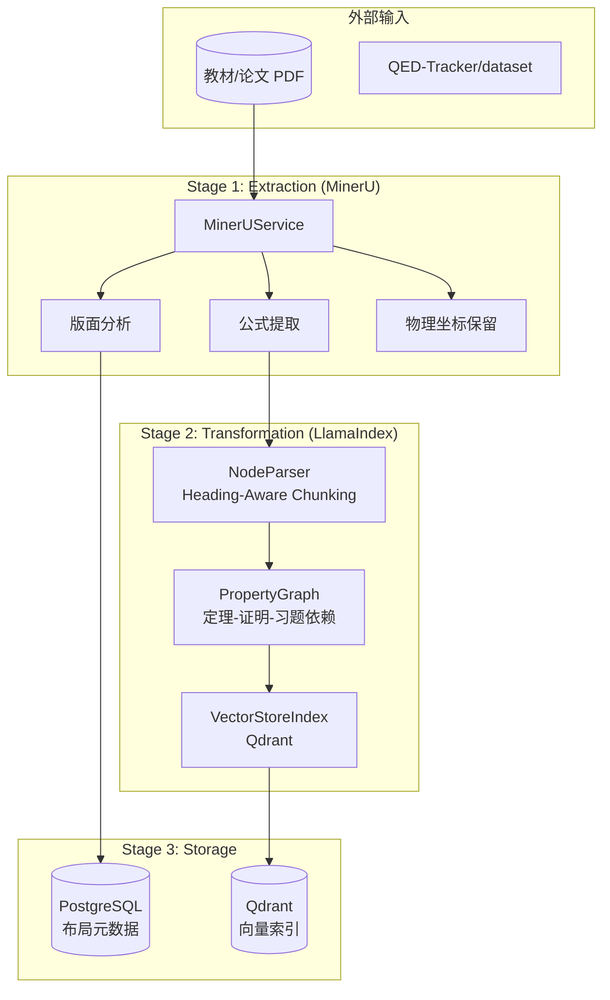
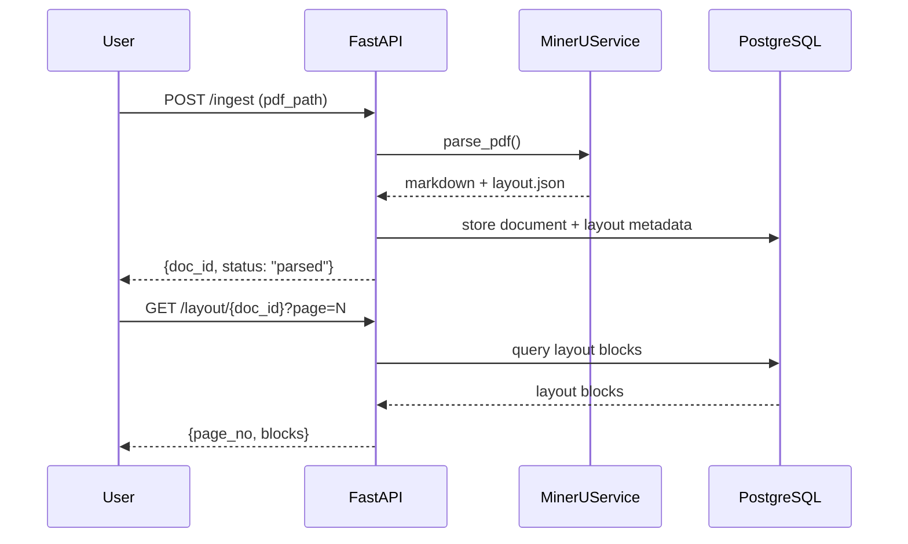
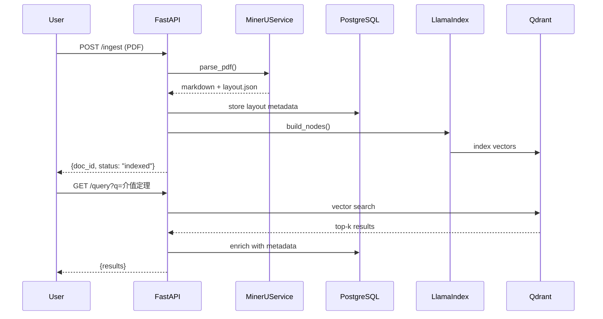

# Axiom-Flow 系统架构

## Pipeline 全景

数据流水线分为三个 Pipeline Stage，但 **实现阶段 (Implementation Phase)** 按依赖关系递进：



### Pipeline Stage vs Implementation Phase

| Pipeline Stage | 对应实现 Phase | 核心组件 | 产出物 |
|---------------|---------------|---------|--------|
| Extraction | Imp Phase 1 | MinerUService | `layout.json` + Markdown |
| Storage (PG) | Imp Phase 1 | LayoutRepo + PG | 布局元数据持久化 |
| Transformation | Imp Phase 2 | LlamaIndex Pipeline | AxiomNode 图 + Qdrant |
| Storage (Qdrant) | Imp Phase 2 | IndexManager + Qdrant | 向量索引 |
| Task Queue | Imp Phase 3 | Redis + Celery | 批量处理 |

## 模块职责

| 模块 | 路径 | 职责 | 实现 Phase |
|------|------|------|-----------|
| **MinerUService** | `app/services/mineru_service.py` | PDF 解析：版面分析、公式提取、坐标保留 | Phase 1 |
| **LayoutRepo** | `app/repository/layout_repo.py` | PostgreSQL 布局元数据 CRUD | Phase 1 |
| **API Router** | `app/api/` | /ingest, /status, /layout 端点 | Phase 1 |
| **NodeParser** | `app/services/node_parser.py` | Markdown → AxiomNode，Heading-Aware Chunking | Phase 2 |
| **GraphBuilder** | `app/services/graph_builder.py` | PropertyGraph：定义-定理-证明-习题依赖链接 | Phase 2 |
| **IndexManager** | `app/services/index_manager.py` | Qdrant 向量索引构建与检索 | Phase 2 |
| **Query API** | `app/api/query.py` | GET /query 语义检索 | Phase 2 |
| **TaskQueue** | `app/services/task_queue.py` | Redis + Celery 异步任务调度 | Phase 3 |

## Phase 1 数据流（当前实现范围）



## 全量数据流（Phase 1 + 2 + 3 打通后）



## 目录结构

```
app/
├── api/                  # FastAPI 路由
│   ├── __init__.py
│   ├── ingest.py         # POST /ingest (Phase 1)
│   ├── status.py         # GET /status (Phase 1)
│   └── layout.py         # GET /layout (Phase 1)
├── core/
│   ├── __init__.py
│   ├── config.py         # Pydantic 配置
│   └── database.py       # SQLAlchemy + Qdrant 连接
├── models/
│   ├── __init__.py
│   ├── axiom_node.py     # AxiomNode ORM 模型 (Phase 2)
│   ├── layout_block.py   # LayoutBlock ORM 模型 (Phase 1)
│   └── document.py       # Document ORM 模型 (Phase 1)
├── repository/
│   ├── __init__.py
│   ├── base.py           # BaseRepository[T]
│   ├── document_repo.py  # Phase 1
│   └── layout_repo.py    # Phase 1
├── services/
│   ├── __init__.py
│   ├── mineru_service.py # MinerU 封装 (Phase 1)
│   ├── node_parser.py    # Markdown → AxiomNode (Phase 2)
│   ├── graph_builder.py  # PropertyGraph (Phase 2)
│   ├── index_manager.py  # Qdrant 索引 (Phase 2)
│   └── task_queue.py     # 异步任务 (Phase 3)
├── main.py               # FastAPI 入口
└── __init__.py
```
