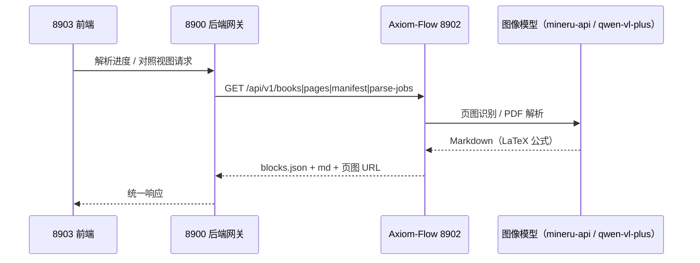

# 8902 API 接口文档

设计状态：Accepted
实现状态：Current（V2-007 第一版；parse-jobs 为内存态同步执行，V2-004 接手 state.sqlite 与后台任务；数据查询类端点为 V2-013 规划契约）
最后更新：2026-08-21
关联代码：`src/axiom_flow/api/main.py`、`src/axiom_flow/schemas.py`（响应结构单一事实源）、`scripts/axiom_flow_service.py`（生命周期脚本）
关联测试：`tests/contract/test_api_v1_contract.py`、`tests/unit/test_service_scripts.py`
关联 ADR：`docs/adr/0001-v2-exploration-direction.md`

> 本文件是 **Axiom-Flow 的固定 API 接口文档**（根仓库 ADR 0010 文档体系范本）：8902 全部对外
> 端点的契约总表，按**接口类型**组织（REQ-046 四类）：① 生命周期与健康；② 数据查询
> （af_* 数据库知识）；③ 解析结果与 PDF 对照；④ 未来 RAG / 知识图谱预留。版本末期确认更新
> 后，前版本契约进 `docs/history/`。本仓库只保证 API 契约与产物格式稳定；8900 侧透传适配
> 见根仓库 `docs/architecture/api-contracts.md` ④数据透传·Axiom-Flow。

## 目的与边界

8902 是 Axiom-Flow（QED-Engine 后端解析组件）的**对外 API 契约总表**：提供解析任务提交、
书目与解析产物查询、原页对照数据供给。8903 前端只连 8900 后端网关（根仓库 ADR 0007），
8900 内部经 `AxiomClient` 适配 8902；8902 离线时 8900 返回 503 并降级展示（独立性铁律，
不影响其他界面）。

接口按类型分为**四类**（2026-08-20 根仓库 REQ-046 分类）：

| 类型 | 端点 | 语义 |
| --- | --- | --- |
| ① 生命周期与健康 | `GET /health` + `scripts/axiom_flow_service.py {start\|stop\|restart\|status}` | 服务启停/重启/健康检测 |
| ② 数据查询（af_*） | `GET /books`、`POST /books/sync`、块判定 `PUT/GET .../review` | af_* 数据库知识（V2-013 规划） |
| ③ 解析结果与 PDF 对照 | `GET /books/{id}`、`/pages/{no}`、`/pages/{no}/image`、`/manifest`、`POST /parse-jobs`、`GET /parse-jobs/{id}` | 解析进度、原始文档对照 |
| ④ 未来 RAG·知识图谱预留 | 见「④ 预留分类」节 | Milvus 接入占位、检索端点设计 |

## 服务信息

- 服务名：Axiom-Flow（FastAPI 标题 Axiom-Flow，version 0.4.0）
- 端口：`8902`（`QED_AXIOM_URL` / `AXIOM_PORT` 可覆盖健康探测端口）
- 前缀：`/api/v1`
- 启动（仓库根目录）：`python -m uvicorn axiom_flow.api.main:app --host 127.0.0.1 --port 8902`
- 生命周期管理：`python scripts/axiom_flow_service.py {start|stop|restart|status} [--port PORT] [--wait [SECONDS]]`



## ① 生命周期与健康

### GET /api/v1/health

存活检查，8900 控制中心与生命周期脚本（`--wait`/`status`）的就绪判据。

```json
{"status": "ok"}
```

### 服务生命周期脚本（scripts/axiom_flow_service.py）

8902 服务唯一启停入口（单文件纯标准库，8900 黑盒调用，契约事实源沿 v0.1 版本
`docs/history/design/service-lifecycle.md`，本文件为其固定落位）：

```text
python scripts/axiom_flow_service.py {start|stop|restart|status} [--port PORT] [--wait [SECONDS]] [--mode local|qed-engine]
```

- `start`：默认拉起后立即返回；`--wait [SECONDS]` 时轮询 `/api/v1/health` 直到就绪（默认超时
  30s）。已运行时报 `already running`，幂等退出 0。成功输出 `pid: <n>` 与 `log: <path>`。
- `stop`：优雅停止（CTRL_BREAK）→ 5s 宽限 → taskkill 强杀兜底 → 清理 PID 文件；无 PID/进程
  已死时清理残留并幂等退出 0。
- `restart`：先 stop 后 start，透传 `--wait` 与 `--mode`。
- `status`：PID 存活 / 端口探测（socket 预检 + HTTP 健康确认）双路径，输出
  `running (pid <n>)` / `running (port probe <port>)` / `stopped`，信息型恒退出 0。
- `--mode local|qed-engine`（V2-014）：start/restart 可传，持久化到 `logs/qed-axiom-mode`；
  不传默认读自身 `.env` 的 `QED_API_SELECT`（缺省 local）；子进程 env 注入 `QED_API_SELECT`
  （模型调用形态设计见 [model-mode-config](../design/model-mode-config.md)）。
- `--port` 优先级：`--port` > `QED_AXIOM_URL` > `AXIOM_PORT` > 8902。
- 退出码：`0` 成功或幂等；`1` 运行失败（spawn 失败、`--wait` 健康超时）；`2` 参数错误。

运行产物：`logs/qed-axiom.pid`（PID 文件）、`logs/qed-axiom-serve.log`（子进程 stdout/stderr，
已 gitignore）。环境：脚本从仓库根向上查找 `.env` 并 `setdefault` 注入 `AXIOM_*` 与供应商
key，已有环境变量不覆盖。

## ② 数据查询（af_* 数据库知识，V2-013 规划契约）

af_* 表（af_books / af_block_reviews）为 Axiom-Flow 私有（qed 库 af_* 命名空间，Alembic
独立建表），表结构见 [database-design.md](database-design.md)；契约冻结与实现由 V2-013 承接
（设计：[af-books-sync](../design/af-books-sync.md)）。以下端点为**规划契约**，冻结前按设计
文档演进。

### GET /api/v1/books

书目列表。**V2-013 冻结前**读文件系统 `data/books/<book_id>/book.json`（自身登记）；冻结后
改读 af_books（含课程归属与解析进度字段），**空表时回退文件系统**（独立性降级）。响应为
`BookMeta` 列表（扩展字段 domain_id/course_id/course_name/knowledge_id/part/display_title/
relative_path/parse_status/pages_done 向前兼容）。

### POST /api/v1/books/sync

批量同步已验证书目（upsert af_books，幂等，book_id 同源 qt_books）。请求：
`[{book_id, domain_id, course_id, course_name, knowledge_id, title, part, display_title, authors, sha256, relative_path, page_count}]`；
响应：`{synced: int, updated: int, books: [...]}`。

### PUT /api/v1/books/{id}/pages/{no}/blocks/{index}/review

块判定写入（upsert af_block_reviews，同块重复判定覆盖更新）。请求：`{verdict: "ok"|"bad", note?: string}`（verdict 枚举校验 422）；响应：判定记录。

### GET /api/v1/books/{id}/pages/{no}/blocks/{index}/review

块判定回显（对照视图）；无判定 → 404。

## ③ 解析结果与 PDF 对照

### GET /api/v1/books/{book_id}

单书目元数据（`BookMeta`：book_id/title/author/page_count/sha256/strategy）。

### GET /api/v1/books/{book_id}/pages/{page_no}

单页完整数据（对照主数据源）：结构化 blocks + 页级 markdown + 原页图 URL。

```json
{
  "blocks": [{"type": "paragraph", "text": "...", "bbox": [...]}],
  "markdown": "# Page 1\n\n...（$$...$$ 内嵌公式）",
  "image_url": "/api/v1/books/{book_id}/pages/{page_no}/image"
}
```

### GET /api/v1/books/{book_id}/pages/{page_no}/image

原页高清图（`image/png`，对照左栏），渲染产物 `pages/pXXXX.png`。

### GET /api/v1/books/{book_id}/manifest

产物清单：文件路径 + 大小 + SHA-256（防篡改/增量），响应为 `ManifestEntry` 列表。

### POST /api/v1/parse-jobs

提交解析任务。请求：`{book_id, pages?, strategy?}`（`pages` 缺省 = 全部页；`strategy` 缺省
`local`）。v0.1 为**内存态同步执行**（逐页识别、产物覆盖落盘，返回 `ParseJob`）；V2-004
接手 state.sqlite 与后台任务后改异步（queued/running/completed/failed）。失败页跳过不中断
任务，`progress.error` 记录摘要（截断 200 字符）。

### GET /api/v1/parse-jobs/{job_id}

任务状态与进度（`ParseJob`：id/book_id/pages/strategy/status/progress）。

### 错误语义

| 场景 | 状态码 |
| --- | --- |
| 参数非法（页码越界、verdict 非枚举等） | 400（verdict 枚举由 8900 侧 422 先行校验） |
| book / page / 页产物不存在 | 404（中文 detail，如「书目不存在：{id}」「页码不存在：{n}」） |
| 推理依赖不可用（mineru-api 未起 / 凭据缺失） | 503（提示运行容器编排脚本或检查凭据） |

8902 离线/5xx 时 8900 返回 503 + `Axiom-Flow 服务不可达：…`（独立性铁律，不影响配置域端点）。

## ④ 未来 RAG·知识图谱预留

本类不开放具体端点，登记**预留设计**（第一版明确不做，仅预留字段与切分点）：

- **Milvus 接入占位**：总体架构中 Milvus 为后续接入占位；blocks 的 `paragraph/formula/table`
  块即天然切分点（块级向量化，无需文本切分器），接入时不改产物格式。
- **检索端点预留**：块级语义检索端点设计（如 `GET /api/v1/search`）待检索任务立项后按 ADR
  流程登记，本文件届时新增分类或小节。
- **知识图谱预留**：`formula.latex` 字段为数学解析器探索入口；块类型 + text 支持定义/定理
  语义识别。af_* 表扩展（如 af_knowledge_blocks）预留命名空间，不提前建表。

## 强制规则

- 响应结构以 `src/axiom_flow/schemas.py` 为单一事实源；本文件与契约测试
  （`tests/contract/test_api_v1_contract.py`）同步守护。
- 只读端点（books/pages/manifest/image/health）不依赖推理凭据（独立性降级）；仅提交解析任务
  时按需初始化图像模型客户端。
- 错误响应不泄漏堆栈与凭据；WSL 不可达映射为可读中文错误信息。
- 新增/变更端点：先更新本文件与契约测试，再实现（根仓库 REQ-002 文档治理）。

## 验证

- 契约测试 `tests/contract/test_api_v1_contract.py` 全绿（health/books/pages/image/manifest/
  parse-jobs 返回结构与 schemas 一致）。
- 全量门禁 `pytest tests -q` + `ruff check src tests`。
- 手动冒烟：`python scripts/axiom_flow_service.py start --wait` → `GET /api/v1/health` 200 →
  `GET /api/v1/books` 返回书目 → `status` → `stop` → `status stopped`。
