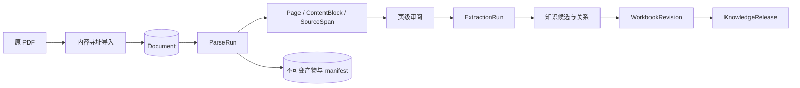
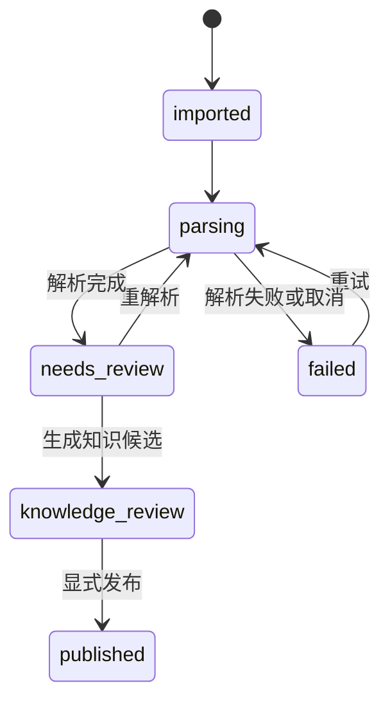
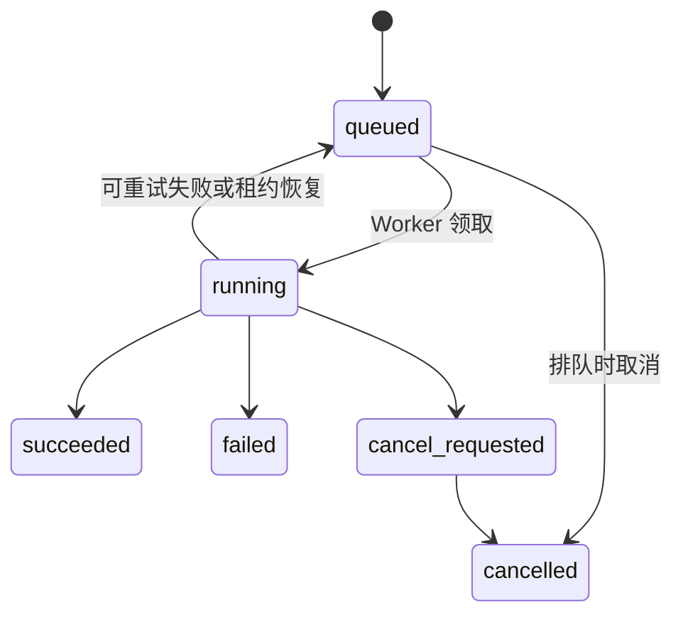
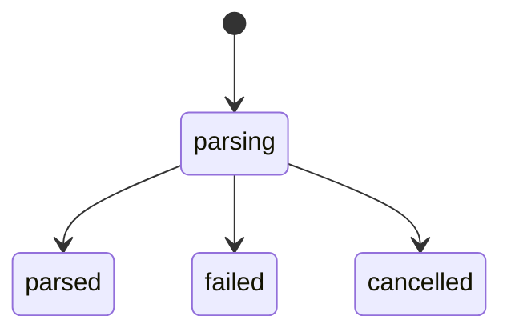
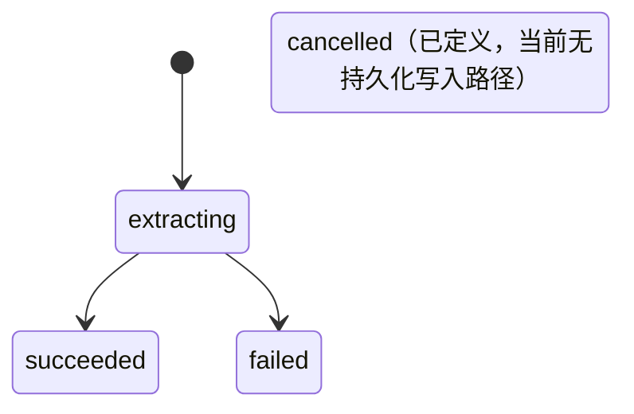

# 数据生命周期与事实来源

设计状态：Accepted
实现状态：Implemented
最后更新：2026-07-29
关联代码：`alembic.ini`、`backend/infrastructure/database.py`、`backend/migrations/env.py`、`backend/migrations/script.py.mako`、`backend/migrations/versions/20260727_0001_mysql_v02.py`
关联测试：`tests/test_architecture_documents.py`、`tests/test_document_workflow.py`、`tests/test_mysql_migrations.py`、`tests/test_current_parse_runs.py`、`tests/test_prune_parse_runs.py`、`tests/test_code_document_mapping.py`
关联 ADR：`docs/adr/0003-excel-publish-source-of-truth.md`、`docs/adr/0005-mysql-runtime-storage.md`、`docs/adr/0008-immutable-parse-artifact-bundles.md`、`docs/adr/0011-current-parse-run-and-prunable-artifacts.md`

## 事实来源

| 数据 | 权威位置 | 版本与修改规则 |
| --- | --- | --- |
| 原 PDF | 本地内容寻址文件 | 按内容哈希不可变；重新导入不覆盖原件。 |
| 页图和解析产物 | 本地不可变产物包 | 页图按渲染契约共享；运行产物以 ParseRun 隔离并由 manifest 校验。 |
| 文档、任务、运行、审阅和候选 | MySQL `af_` 表 | 运行事实追加保存；表结构只通过 Alembic 显式迁移。 |
| 当前解析结果 | `current_parse_run_id` 与选择历史 | 新成功运行只是候选，只有显式选择才改变当前事实来源。 |
| Excel 工作簿 | 本地草稿文件及 MySQL revision | 人工编辑入口，不是运行查询事实源；导入先校验并创建新草稿。 |
| 已发布知识 | MySQL KnowledgeRelease 快照 | 只由显式发布创建，不就地修改旧版本。 |

## 领域状态

以下图使用代码中的实际字符串值，不把处理阶段名称伪装成领域状态。

## 版本、事务与清理

- `Document`、`Job`、`ParseRun`、`ExtractionRun`、页面、候选、审阅、工作簿和发布记录使用稳定 ID。
- 数据库迁移路径相对 `alembic.ini` 定位，连接 URL 由环境或调用方注入；应用启动只校验 schema。
- 页级检查点先形成可校验产物，再登记成功页面；失败响应只保存诊断，不能成为页面事实。
- 开发库只能通过受保护工具显式重建；普通启动和 Alembic 升级不得删除运行数据。
- 旧 ParseRun 可先移动私有产物到 trash，并把数据库明细变为 `pruned` 墓碑；原 PDF、共享页图、
  当前运行和选择历史不进入普通清理范围。
- trash 阶段可恢复；显式 purge 后只能从执行前备份恢复。
