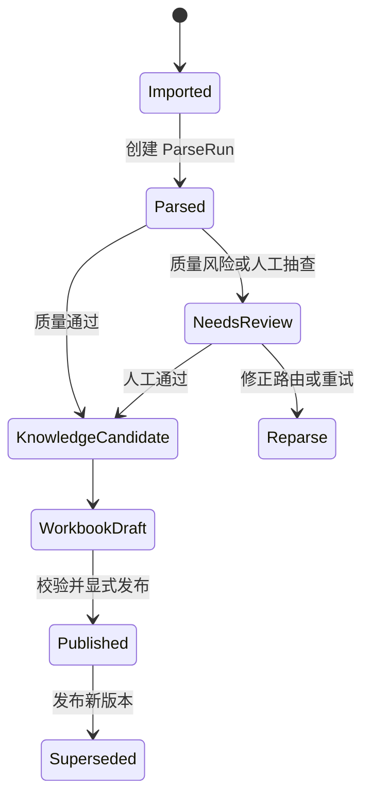

# 数据生命周期与事实来源

设计状态：Accepted
实现状态：Implemented
最后更新：2026-07-27
关联代码：`backend/app/store.py`、`backend/migrations/env.py`、`backend/migrations/versions/20260727_0001_mysql_v02.py`
关联测试：`tests/test_v02_pipeline.py`、`tests/test_mysql_migrations.py`、`tests/test_code_document_mapping.py`
关联 ADR：`docs/adr/0005-mysql-runtime-storage.md`、`docs/adr/0003-excel-publish-source-of-truth.md`

- 原 PDF 不可变，以内容哈希和文档版本标识。
- MySQL 仅保存 `af_` 前缀的运行事实；表结构通过 Alembic 显式迁移，不允许启动时自动建表。
- 每次解析和抽取分别生成独立 `ParseRun`、`ExtractionRun`；旧页面、候选和审阅事件不被覆盖。
- 长任务先写入 `af_jobs`，Worker 按租约领取并记录任务级进度、调用量、重试和错误。
- 每个内容块和知识候选必须保存文档版本、页码、源文本或坐标、处理版本与质量状态。
- Excel 导入先创建草稿版本；只有校验成功并由用户显式发布后，才更新运行时知识快照。
- 已发布版本不可就地修改；新修改创建新版本，旧版本标记为 `Superseded`。
- 开发库只能通过受保护工具显式重建；普通启动和 Alembic 升级不得删除运行数据。
