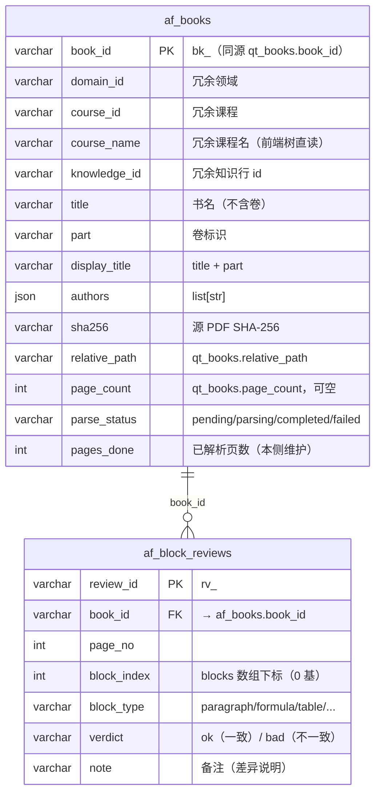

# 数据库设计（Axiom-Flow af_* 命名空间）

设计状态：Accepted
实现状态：Pending（表结构登记为 V2-013 规划契约；Alembic 建表与端点实现待 V2-013）
最后更新：2026-08-21
关联代码：无（V2-013 建表后登记 `src/axiom_flow/` 对应模块）
关联测试：`tests/contract/test_architecture_documents.py`（本文档守护）
关联 ADR：`docs/adr/0001-v2-exploration-direction.md`、根仓库 [ADR 0010](https://github.com/QED-Engine/qed-engine/blob/main/docs/adr/0010-documentation-versioning.md)（固定文档范本）、根仓库 ADR 0003（共享 qed 库独立性例外）

> 本文件是 **Axiom-Flow 的固定数据库设计文档**（根仓库 ADR 0010 范本 / REQ-047）：登记
> Axiom-Flow 在共享 MySQL `qed` 库中的私有表（`af_*` 命名空间）设计。根仓库总纲
> （QED-Engine `docs/architecture/database-design.md`）只维护命名空间隔离规则，**不复制本文件
> 的表结构**（REQ-027 确认动作，2026-08-20 用户裁决：af_* 部分置空，指向子项目数据库文档）。

## 目的与边界

- MySQL 8，库名 `qed`，三项目共用同一实例与库（根仓库 ADR 0003 独立性铁律的明确例外）。
- 表命名空间隔离：QED-Tracker 使用 `qt_*` 前缀，Axiom-Flow 使用 `af_*` 前缀；**互不读取对方
  表**。共享 `qed_*` 前缀表族（qed_domain/qed_course/qed_llm_calls 等）所有权 QED-Tracker，
  本仓库只读不写（`qed_llm_calls` 例外：三项目均可写入调用记录）。
- af_* 表为 Axiom-Flow **私有**：只从 qt_books 同步已验证书行的只读元数据，任何外部故障/
  变更不影响本表读取；Axiom-Flow 用 Alembic 独立初始化自己的表，不依赖其他项目迁移。
- 凭据与库名唯一事实源：根 `.env` 的 `QED_DB_*` 变量；密码值绝不下发。

## 表清单总览

| 表 | 前缀 | 一行 = | 状态 | 事实源 |
| --- | --- | --- | --- | --- |
| `af_books` | af_*（私有） | 一册已验证书（qt_books 只读快照 + 解析进度，本侧维护） | **规划**（V2-013 承接） | 本文档 |
| `af_block_reviews` | af_*（私有） | 一次块级判定（人工核对一致/不一致） | **规划**（V2-013 承接） | 本文档 |



## af_books（书目表，一行 = 一册已验证书）

```sql
CREATE TABLE af_books (
  book_id         VARCHAR(100)  NOT NULL,         -- PK：同源 qt_books.book_id（bk_<md5>）
  domain_id       VARCHAR(32)   NOT NULL DEFAULT '', -- 冗余领域（同步时由知识行推导）
  course_id       VARCHAR(64)   NOT NULL DEFAULT '', -- 冗余课程
  course_name     VARCHAR(200)  NOT NULL DEFAULT '', -- 冗余课程名（前端树直读）
  knowledge_id    VARCHAR(100)  NOT NULL DEFAULT '', -- 冗余知识行 id
  title           VARCHAR(500)  NOT NULL DEFAULT '', -- 书名（不含卷）
  part            VARCHAR(32)   NOT NULL DEFAULT '', -- 卷标识（第一册/上册…）
  display_title   VARCHAR(500)  NOT NULL DEFAULT '', -- 展示名 = title + part
  authors         JSON          NOT NULL,         -- list[str]
  sha256          VARCHAR(64)   NOT NULL DEFAULT '', -- 源 PDF SHA-256
  relative_path   VARCHAR(500)  NOT NULL DEFAULT '', -- qt_books.relative_path（解析输入定位）
  page_count      INT           NULL,             -- 同步自 qt_books.page_count
  parse_status    VARCHAR(24)   NOT NULL DEFAULT 'pending', -- pending/parsing/completed/failed
  pages_done      INT           NOT NULL DEFAULT 0, -- 已解析页数（本侧维护）
  synced_at       DATETIME      NOT NULL,         -- 最近同步时间
  updated_at      DATETIME      NOT NULL,
  PRIMARY KEY (book_id),
  KEY ix_af_books_course (course_id),
  KEY ix_af_books_status (parse_status)
) ENGINE=InnoDB DEFAULT CHARSET=utf8mb4 COMMENT='书目同步表：QED-Tracker 已验证书目的只读快照 + 解析进度（Axiom-Flow 私有）';
```

### 同步语义

- **幂等**：同步以 `book_id` 为幂等键，重复同步只 upsert 不产生重复行；qt_books 删除/变更
  不影响已同步行（快照语义）。
- **进度自持**：解析进度（pages_done/parse_status）由 Axiom-Flow 侧维护（解析任务/产物推断），
  不依赖 qt_books.page_count 之外的上游字段。更新路径：parse-jobs 完成页 / 产物落盘后回写
  （V2-004 state.sqlite 接手后由后台任务回写；第一版可在 parse-jobs 同步执行结束时回写）。
- **字段冗余**：课程归属（domain_id/course_id/course_name）冗余进表，前端只消费 8902
  `/books` 即可建树（8901 离线不影响树展示）。

## af_block_reviews（块判定表，一行 = 一次块级判定）

```sql
CREATE TABLE af_block_reviews (
  review_id       VARCHAR(100)  NOT NULL,         -- PK：rv_<md5(book_id:page_no:block_index)>
  book_id         VARCHAR(100)  NOT NULL,         -- FK → af_books.book_id；索引
  page_no         INT           NOT NULL,
  block_index     INT           NOT NULL,         -- blocks 数组下标（0 基）
  block_type      VARCHAR(24)   NOT NULL,         -- paragraph/formula/table/…
  verdict         VARCHAR(24)   NOT NULL,         -- ok（一致）/ bad（不一致）
  note            VARCHAR(1000) NOT NULL DEFAULT '', -- 备注（差异说明）
  reviewed_at     DATETIME      NOT NULL,
  updated_at      DATETIME      NOT NULL,
  PRIMARY KEY (review_id),
  UNIQUE KEY uq_af_block_reviews_pos (book_id, page_no, block_index)
) ENGINE=InnoDB DEFAULT CHARSET=utf8mb4 COMMENT='块判定表：文档解析管理对照视图中人工核对结果（一致/不一致）';
```

- 同块重复判定 = 覆盖更新（幂等，UNIQUE 键 + upsert）。
- 判定只记录结论，不存内容修改（修改功能暂缓，后续轮扩展）。

## 迁移与维护

- `qed` 库由各项目 Alembic **独立初始化**自己的表，互不影响；`qed_*` 共享表由 QED-Tracker
  Alembic 建表与维护（本仓库只读）。
- 新增表或字段变化：先更新本文档与对应契约测试，再实现迁移（根仓库 REQ-047 数据库设计
  长期任务）。
- 规划边界：本文档登记的表为 **V2-013 规划契约**，冻结节点以 V2-013 回执为准；冻结前设计
  演进以 [af-books-sync](../design/af-books-sync.md) 为准，本文档随其定稿同步。

## 敏感字段规则

- 凭据（`QED_DB_PASSWORD` 等）绝不下发到任何接口响应、日志或异常信息；本仓库不暴露数据库
  连接端点，数据库能力由 8900 `/config/database` 启动快照统一呈现（配置域契约归根仓库）。

## 验证

- `tests/contract/test_architecture_documents.py` 全绿（本文档守护：表清单、命名空间声明）。
- V2-013 落地后：Alembic 迁移可重复执行（升级→降级→升级）；sync 幂等（重复同步不产生重复
  行）；review upsert 覆盖；8901/8902 离线降级不影响本表读取。
