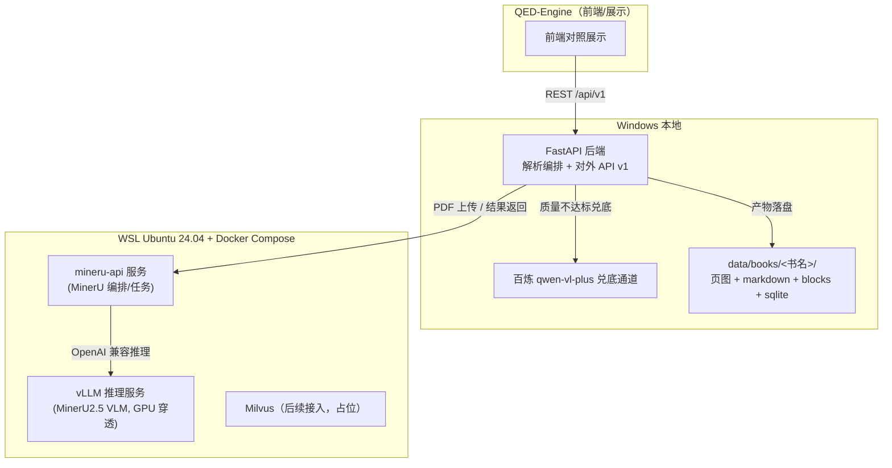

# 系统概览（v2）

设计状态：Accepted
实现状态：Pending
最后更新：2026-08-14
关联代码：无（新包结构实现中，见 code-map）
关联测试：无（新测试体系建立中）
关联 ADR：`docs/adr/0001-v2-exploration-direction.md`

## 定位

Axiom-Flow 是 QED-Engine 的**后端解析组件**：把 PDF 教材完整解析为统一格式（Markdown/LaTeX/
结构化块），支撑 QED-Engine 前端做高还原对照展示。前端由 QED-Engine 负责，本仓库只保证
API 契约与产物格式稳定。

## 运行拓扑

## 边界原则

- Windows 应用层 → WSL 推理服务只经 HTTP 双向调用，WSL 不直接读写 Windows 文件系统。
- 容器化边界：仅推理服务（GPU 密集型、依赖复杂）进容器；应用层留在 Windows。
- 产物一律由 Windows 编排层落盘 `data/`，milvus 后续接入不改变产物格式。

## 第一版范围

解析 + 渲染数据供给（导入 → MinerU 解析 → 质量校验 → 兜底 → 产物落盘 → API 暴露）。
Milvus 检索、知识图谱、数学解析器为后续探索项，仅预留字段。
