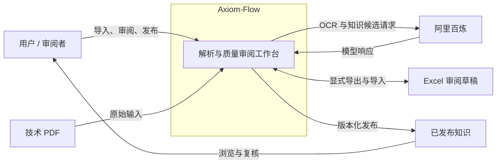

# 系统总览

设计状态：Accepted
实现状态：Implemented
最后更新：2026-07-29
关联代码：当前受管实现见 `docs/architecture/code-map.md`
关联测试：`tests/contract/test_architecture_documents.py`、`tests/contract/test_code_document_mapping.py`
关联 ADR：`docs/adr/0005-mysql-runtime-storage.md`、`docs/adr/0006-persistent-jobs-and-api-v1.md`、`docs/adr/0010-qwen-ocr-only-rudin-trial.md`

## 定位与用户

Axiom-Flow 是 QED 的本地优先技术 PDF 解析与质量审阅组件。当前用户是需要检查数学教材、
论文和习题集解析质量的本地操作者。系统接收技术 PDF 和人工审阅命令，输出可追溯解析产物、
Excel 审阅草稿和显式发布的知识版本。

## 系统边界

系统负责 PDF 导入、页面解析、来源证据、质量审阅、知识候选、工作簿校验和知识发布。模型原始
响应不是领域事实；只有经过规范化、持久化和审阅的数据才能进入后续流程。

系统不负责训练或托管模型，不把 Excel 当作运行查询库，也不把未发布候选提供给下游学习功能。
对话、图片问答、练习、学习进度、向量检索和图数据库投影不属于当前交付能力。

内部进程、依赖方向和能力归属见[运行架构](runtime-architecture.md)，事实来源、状态和清理边界
见[数据生命周期](data-lifecycle.md)。
