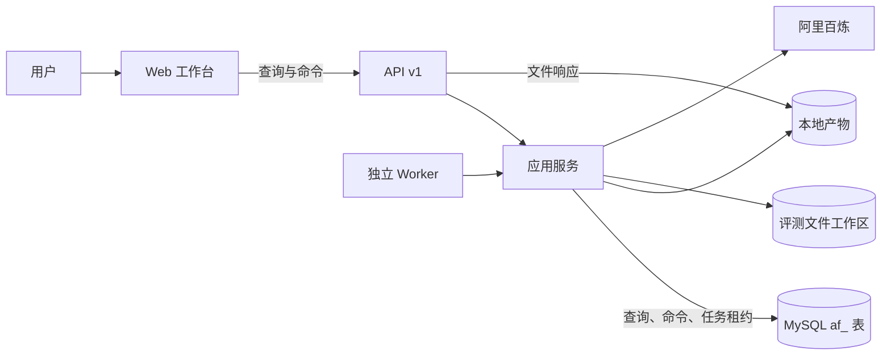
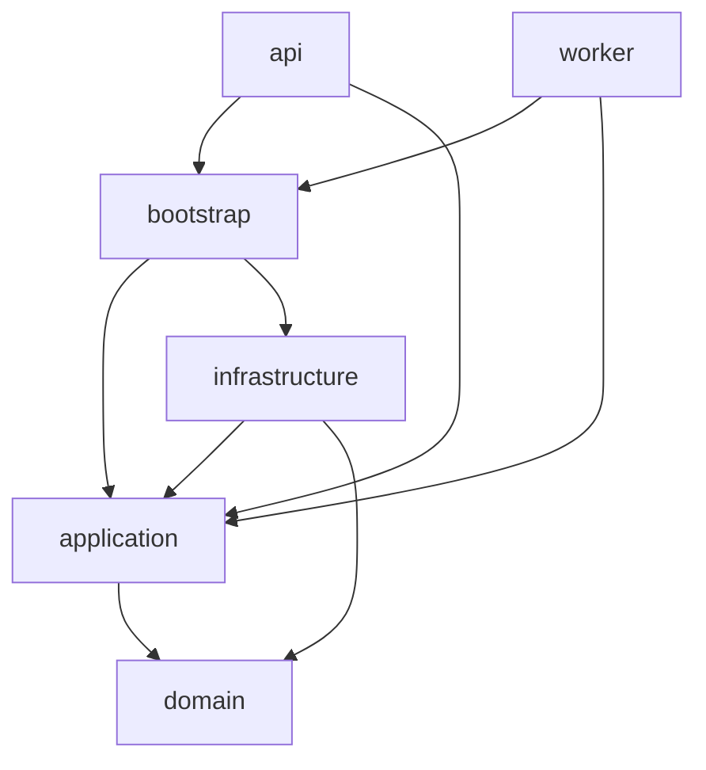

# 当前运行架构

设计状态：Accepted
实现状态：Implemented
最后更新：2026-07-30
关联代码：`src/axiom_flow/domain/models.py`、`src/axiom_flow/application/ports.py`、`src/axiom_flow/bootstrap.py`、`src/axiom_flow/infrastructure/mysql.py`、`src/axiom_flow/api/schemas.py`、`src/axiom_flow/migrations/versions/20260727_0002_v03_jobs_and_history.py`
关联测试：`tests/contract/test_architecture_documents.py`、`tests/contract/test_architecture_dependencies.py`、`tests/integration/test_jobs.py`、`tests/integration/test_api.py`、`tests/integration/test_evaluation_workspace.py`、`tests/contract/test_code_document_mapping.py`
关联 ADR：`docs/adr/0005-mysql-runtime-storage.md`、`docs/adr/0006-persistent-jobs-and-api-v1.md`、`docs/adr/0007-versioned-domain-records.md`、`docs/adr/0018-src-package-and-application-owned-workflows.md`、`docs/adr/0020-document-centric-evaluation-workspace.md`

本文件同时记录 Accepted 架构约束和当前实现符合度。运行调用图描述进程间实际交互；代码依赖图
描述允许的 Python 包依赖方向，两者不能互相替代。

API、Worker 和其他模块的主设计关联以[代码映射](code-map.md)为准；它们在本文件中只作为运行
拓扑和符合度证据，不改变各自 DesignRef。

## 运行拓扑

API 和 Worker 是两个独立进程。长任务先进入 MySQL 队列，Worker 通过租约领取并调用应用服务；
本地文件保存原 PDF、页图、模型诊断和不可变解析产物。API 不执行模型长任务。

## 代码依赖方向

- `domain` 定义状态、稳定任务视图和领域异常，不依赖框架、供应商或外层包。
- `application` 定义文档、任务、审阅、发布用例和供应商/pipeline 端口，不导入基础设施或外部适配库。
- 评测用例属于 `application`；文件工作区是 `infrastructure` 适配器，不写 MySQL，也不绕过 Job/Worker。
- `infrastructure` 实现 MySQL、文件产物、PyMuPDF、百炼和 OpenPyXL 适配。
- `bootstrap.py` 是唯一装配根；API 和 Worker 不直接导入 `infrastructure`。
- `api` 负责 HTTP 校验、资源表示和错误翻译；`worker` 负责租约执行循环。

## 能力与运行职责

| 业务能力 | 当前职责 | 当前实现所有者 |
| --- | --- | --- |
| Document | PDF 导入、内容标识、文档状态与当前解析运行选择 | `DocumentApplicationService`、`PDFPipeline` |
| Parsing | 页面渲染、OCR、规范化内容、来源证据和解析产物 | `PDFPipeline`、`VisionProvider`、产物适配器 |
| Quality Review | 页面风险数据、人工审阅状态和重解析请求 | `ReviewApplicationService` |
| Parsing Evaluation | ParseRun 快照、逐页比较、人工结论与报告 | `EvaluationApplicationService`、`EvaluationWorkspace` |
| Knowledge | 候选节点、关系、证据、审阅状态和发布快照 | `ReviewApplicationService`、`KnowledgeProvider` |
| Workbook | Excel 导出、导入校验、草稿版本和显式发布 | `WorkbookService`、`OpenPyxlWorkbookGateway` |

| 运行职责 | 边界 |
| --- | --- |
| Web/API | 展示资源、接收命令和返回文件，不执行模型任务。前端工作台按 QED-Engine ADR 0002 规划迁入根仓库统一前端（8903），迁移完成后本仓库 `web/` 退役，API 保持服务。 |
| Jobs/Worker | 幂等入队、租约、心跳、重试、取消和恢复，不解释 PDF 或知识语义。 |

## 架构符合度

| Accepted 约束 | 当前状态 | 证据与跟踪 |
| --- | --- | --- |
| Domain 和 Application 不反向依赖外层 | 符合 | `tests/contract/test_architecture_dependencies.py` |
| API/Worker 不直接导入基础设施 | 符合 | `tests/contract/test_architecture_dependencies.py` |
| `bootstrap.py` 是唯一装配根 | 符合 | `src/axiom_flow/bootstrap.py` |
| API 只经应用用例访问业务能力 | 符合 | 文档、任务、审阅和发布路由只调用容器中的应用服务；由依赖测试守护。 |
| 应用层不依赖外部适配库 | 符合 | HTTPX、OpenPyXL、PyMuPDF 和 SQLAlchemy 只存在于基础设施或传输层。 |
