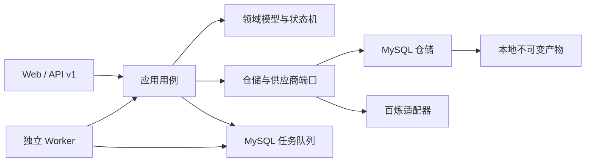

# v0.3 目标架构

设计状态：Accepted
实现状态：In Progress
最后更新：2026-07-27
关联代码：尚未实现
关联测试：`tests/test_code_document_mapping.py`
关联 ADR：`docs/adr/0006-persistent-jobs-and-api-v1.md`、`docs/adr/0007-versioned-domain-records.md`

## 分层

- 领域层定义实体、值对象、状态枚举、转换规则和领域异常，不依赖 FastAPI、SQLAlchemy 或供应商 SDK。
- 应用层实现导入、提交解析、执行解析、审阅、抽取、工作簿和发布用例，只依赖端口。
- 基础设施层实现 MySQL 仓储、任务租约、本地产物和百炼适配器。
- API 只完成协议校验、用例调用和错误翻译；Worker 只负责领取任务并调用对应执行用例。

## 核心事实

`Document`、`Job`、`ParseRun`、`Page`、`ContentBlock`、`SourceSpan`、`QualityReport`、
`ExtractionRun`、`KnowledgeNode`、`KnowledgeEdge`、`ReviewEvent`、`WorkbookRevision` 和
`KnowledgeRelease` 都有稳定 ID。解析、抽取和审阅记录只追加版本；“最新”必须通过显式
成功运行查询得到，不能靠覆盖旧行实现。

本地 PDF、页图和工作簿以内容哈希组织。数据库保存产物索引和哈希，不把绝对路径暴露给 API。
后续检索和学习服务只能读取已发布 `KnowledgeRelease`。

