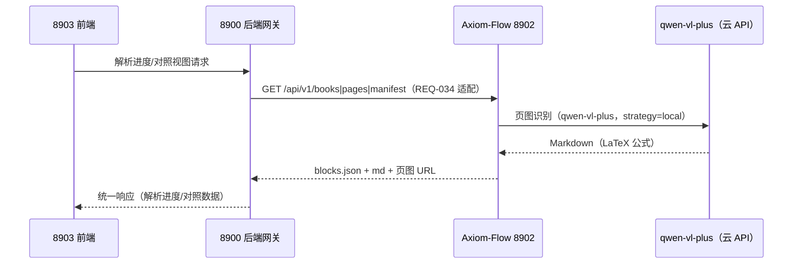

# 8902 集成契约与联调对齐（Axiom-Flow × QED-Engine）

设计状态：Accepted
实现状态：Pending（V2-007 实现后冻结，本契约草案供根仓库 REQ-034 评审）
最后更新：2026-08-16
关联代码：`src/axiom_flow/schemas.py`（统一格式 Pydantic 模型，单一事实源）、`src/axiom_flow/api/`（待 V2-007 实现）
关联测试：契约测试（V2-007 完成后落地 `tests/contract/`）
关联 ADR：无（联调契约冻结前不新增 ADR；契约冻结以 V2-007 回执为准）

## 目的与范围

本文件是 Axiom-Flow 与 QED-Engine 联调的对齐依据（integration-matrix C 组：8900 ↔ 8902）：
定义双方交付时序、8902 API 契约草案与待对齐问题。8900 侧适配由根仓库执行（REQ-034），
本仓库只保证 8902 契约与产物格式稳定；8903 前端只连 8900（根仓库 ADR 0007）。

## 联调时序（双方职责）

| 阶段 | Axiom-Flow（8902 侧） | QED-Engine（8900 侧） | 对齐触发 |
| --- | --- | --- | --- |
| ① 识别验证 | V2-010 C 类实验：qwen-vl-plus 通道验证（Rudin 1-20 页） | 并行开发，不等待 | 实验报告（本仓库计划文档） |
| ② 同步开发 | V2-006 fallback + V2-007 最小 API（8902 起服务） | REQ-034 适配准备（api/axiom.py、clients/axiom_client.py 按本契约草案） | 本契约文档 + V2-007 契约冻结 |
| ③ 联调 | 8902 真实数据（parse-jobs/books/pages/manifest） | 8900 数据域转发 → 8903「文档解析进度/原始文档对照」 | 联调冒烟：全链路（8903→8900→8902） |
| ④ 深化 | MinerU 接入（V2-005）、hybrid 策略、质量校验细化 | /monitor/mineru 托管监控闭环 | V2-005 完成 |
| ⑤ 本地化 | 模型部署 WSL（vLLM），替换云 API | 无 | ④ 稳定后 |

## 8902 API 契约草案（V2-007 冻结）

| 端点 | 用途 | 响应核心字段 |
| --- | --- | --- |
| `POST /api/v1/parse-jobs` | 提交解析任务（book_id、pages、strategy） | `ParseJob`（id/status/progress） |
| `GET /api/v1/parse-jobs/{id}` | 任务状态与进度 | `ParseJob`（queued/running/completed/failed） |
| `GET /api/v1/books` | 书目列表（含解析进度） | `BookMeta` 列表 |
| `GET /api/v1/books/{id}/pages/{no}` | 单页完整数据（原页图 URL + markdown + blocks） | `BlocksPage` + 页图 URL + `pXXXX.md` |
| `GET /api/v1/books/{id}/manifest` | 产物清单（文件路径/大小/哈希） | `ManifestEntry` 列表 |

- 契约事实源：`src/axiom_flow/schemas.py`（BookMeta/BlocksPage/Block/ParseJob/ParseJobCreate/ManifestEntry/Strategy/JobStatus/PageState）。
- 错误语义：8902 离线时 8900 返回 503（独立性铁律已守护）；8902 侧 400（参数非法）/404（book/page 不存在）/503（推理依赖不可用，提示运行 `infra-up.ps1` 或检查凭据）。
- 兜底：任务 `strategy=hybrid` 或页质量不达标时走 qwen-vl-plus（`source=qwen-vl-plus` 标记）。
- 端口与配置：8902 固定；根仓库经 `QED_AXIOM_URL` 注入地址（见待对齐问题 A1）。

## 待对齐问题清单

| ID | 问题 | 现状 | 建议 |
| --- | --- | --- | --- |
| A1 | `QED_AXIOM_URL` 注入与 8900 CORS 白名单 | 8900 CORS 白名单已含 8902（根仓库 config-center-api.md） | 8902 服务启动方式（uvicorn 入口）冻结后告知根仓库 |
| A2 | 产物落盘位置：`data/books/` vs `dataset/axiom-flow/parsed/`（ALN-003 Phase 3） | 设计文档当前为 `data/books/<book_id>/` | 本轮联调用 `data/books/`，ALN-003 后续单独承接 |
| A3 | ALN-006 批量导入解析接口（REQ-015） | v1 登记 Open，v2 未承接 | 延后至联调闭环后拆 B/D 类计划 |
| A4 | ALN-008 治理契约范本对齐（REQ-022） | v1 设计文档已建，v2 推倒后契约测试已重写 | 可并入 V2-007 契约测试轮顺手对齐 |
| A5 | 验收样本：V2-008（Rudin + 陈纪修各 20 页） | 设计文档验收标准已定（公式可渲染率 ≥90%） | 联调冒烟与 V2-008 验收共用样本与指标 |
| A6 | V2-003 越界产物回执（REQ-036） | 本仓库已提交 `d019777`（审阅通过） | 根仓库读本仓库 git 历史登记回执，无需本仓库动作 |

## 执行与验证

- V2-007 完成 = 契约冻结：本契约文档元数据更新（实现状态 Current）、契约测试落地、todo 登记回执。
- 联调验收：8903→8900→8902 全链路冒烟；8902 离线时 8900 降级 503 不破坏独立性铁律。
- 本契约草案供根仓库评审（REQ-034 前置）；契约冻结后如需调整，按跨项目协作流程（本仓库 `docs/standards/cross-project-collaboration.md`）执行。
