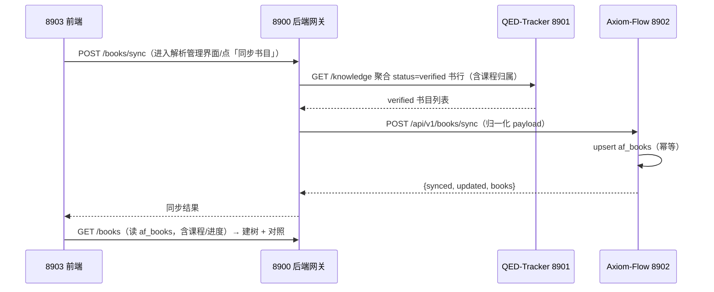

# af_books 书目同步与块判定（Axiom-Flow × QED-Engine 文档解析管理）

设计状态：Draft
实现状态：Not Started
最后更新：2026-08-18
关联代码：`src/axiom_flow/api/main.py`（8902 API）、`src/axiom_flow/ingest/`（数据目录）
关联测试：契约测试（V2-007 扩展）、`tests/unit/`（sync 归一化/判重）
关联 ADR：无（探索基线，实施验证后按需沉淀）
需求方：QED-Engine 根仓库（文档解析管理轮，跨项目请求）

## 背景与动机

QED-Engine「文档解析管理」界面需要按课程树展示**已验证（verified）书目**及其解析进度，
并支持**块级对照判定**（段落/公式/表格逐块核对「一致/不一致」）。现状：

- 8902 `/books` 读文件系统 `data/books/<book_id>/book.json`（自身登记），与 QED-Tracker
  的 `qt_books`（verified 状态、课程归属）无关联，前端无法按课程建树；
- 块级判定无存储位置。

2026-08-18 用户裁决：**Axiom-Flow 侧新建 af_* 书目表**，从 QED-Tracker 同步已验证书目
（book_id 同源），解析进度与判定独立维护在 af_* 表——与 QED-Tracker 完全解耦（出问题
不影响 QED-Tracker）；同步由前端触发；课程信息冗余进 af_books（前端只读 8902 建树）。

## 设计原则

1. **解耦**：af_* 表为 Axiom-Flow 私有（qed 库 af_* 命名空间），只从 qt_books 同步
   已验证书行的只读元数据；QED-Tracker 任何故障/变更不影响本表读取。
2. **幂等**：同步以 `book_id`（同源 qt_books.book_id，bk_<md5>）为幂等键，重复同步
   只 upsert 不产生重复行；qt_books 删除/变更不影响已同步行（快照语义）。
3. **进度自持**：解析进度（pages_done/parse_status）由 Axiom-Flow 侧维护（解析任务/
   产物推断），不依赖 qt_books.page_count 之外的上游字段。
4. **字段冗余**：课程归属（domain_id/course_id/course_name）冗余进 af_books，前端
   只消费 8902 `/books` 即可建树（8901 离线不影响树展示）。

## 表结构（qed 库，af_* 命名空间，Axiom-Flow Alembic 建表维护）

### af_books（书目表，一行 = 一册已验证书）

```sql
CREATE TABLE af_books (
  book_id         VARCHAR(100)  NOT NULL,         -- PK：同源 qt_books.book_id（bk_<md5>）
  domain_id       VARCHAR(32)   NOT NULL DEFAULT '', -- 冗余领域（同步时由知识行推导）
  course_id       VARCHAR(64)   NOT NULL DEFAULT '', -- 冗余课程
  course_name     VARCHAR(200)  NOT NULL DEFAULT '', -- 冗余课程名（前端树直读）
  knowledge_id    VARCHAR(100)  NOT NULL DEFAULT '', -- 冗余知识行 id
  title           VARCHAR(500)  NOT NULL DEFAULT '', -- 书名（不含卷）
  part            VARCHAR(32)   NOT NULL DEFAULT '', -- 卷标识（第一册/上册…）
  display_title   VARCHAR(500)  NOT NULL DEFAULT '', -- 展示名 = title + part
  authors         JSON          NOT NULL,         -- list[str]
  sha256          VARCHAR(64)   NOT NULL DEFAULT '', -- 源 PDF SHA-256
  relative_path   VARCHAR(500)  NOT NULL DEFAULT '', -- qt_books.relative_path（解析输入定位）
  page_count      INT           NULL,             -- 同步自 qt_books.page_count
  parse_status    VARCHAR(24)   NOT NULL DEFAULT 'pending', -- pending/parsing/completed/failed
  pages_done      INT           NOT NULL DEFAULT 0, -- 已解析页数（本侧维护）
  synced_at       DATETIME      NOT NULL,         -- 最近同步时间
  updated_at      DATETIME      NOT NULL,
  PRIMARY KEY (book_id),
  KEY ix_af_books_course (course_id),
  KEY ix_af_books_status (parse_status)
) ENGINE=InnoDB DEFAULT CHARSET=utf8mb4 COMMENT='书目同步表：QED-Tracker 已验证书目的只读快照 + 解析进度（Axiom-Flow 私有）';
```

- 同步时 qt_books 无 page_count 的书（NULL）允许入库，前端按「页数未知」展示。
- 解析进度更新路径：parse-jobs 完成页 / 产物落盘后更新 `pages_done`/`parse_status`
  （V2-004 state.sqlite 接手后由后台任务回写；第一版可在 parse-jobs 同步执行结束时回写）。

### af_block_reviews（块判定表，一行 = 一次块级判定）

```sql
CREATE TABLE af_block_reviews (
  review_id       VARCHAR(100)  NOT NULL,         -- PK：rv_<md5(book_id:page_no:block_index)>
  book_id         VARCHAR(100)  NOT NULL,         -- FK → af_books.book_id；索引
  page_no         INT           NOT NULL,
  block_index     INT           NOT NULL,         -- blocks 数组下标（0 基）
  block_type      VARCHAR(24)   NOT NULL,         -- paragraph/formula/table/…
  verdict         VARCHAR(24)   NOT NULL,         -- ok（一致）/ bad（不一致）
  note            VARCHAR(1000) NOT NULL DEFAULT '', -- 备注（差异说明）
  reviewed_at     DATETIME      NOT NULL,
  updated_at      DATETIME      NOT NULL,
  PRIMARY KEY (review_id),
  UNIQUE KEY uq_af_block_reviews_pos (book_id, page_no, block_index)
) ENGINE=InnoDB DEFAULT CHARSET=utf8mb4 COMMENT='块判定表：文档解析管理对照视图中人工核对结果（一致/不一致）';
```

- 同块重复判定 = 覆盖更新（幂等，UNIQUE 键 + upsert）。
- 判定只记录结论，不存内容修改（修改功能暂缓，后续轮扩展）。

## API 契约扩展（8902）

| 端点 | 用途 | 请求 | 响应 |
| --- | --- | --- | --- |
| `POST /api/v1/books/sync` | 批量同步已验证书目（upsert af_books） | `[{book_id, domain_id, course_id, course_name, knowledge_id, title, part, display_title, authors, sha256, relative_path, page_count}]` | `{synced: int, updated: int, books: [...]}` |
| `GET /api/v1/books` | 书目列表**改读 af_books**（含课程/进度字段） | — | `BookMeta` 扩展：domain_id/course_id/course_name/knowledge_id/part/display_title/relative_path/parse_status/pages_done |
| `GET /api/v1/books/{id}/pages/{no}/blocks` | 单页块列表（供前端对照渲染，可与 pages 端点合并） | — | `[{index, type, text, latex, html, items, bbox}]` |
| `PUT /api/v1/books/{id}/pages/{no}/blocks/{index}/review` | 块判定（upsert af_block_reviews） | `{verdict: "ok"\|"bad", note?: string}` | 判定记录 |
| `GET /api/v1/books/{id}/pages/{no}/blocks/{index}/review` | 查询某块判定（对照视图回显） | — | 判定记录或 404 |
| `GET /api/v1/books/{id}/reviews` | 全书/分页判定汇总（可选，后续） | — | 判定列表 |

- 错误语义：与既有契约一致（400 参数非法 / 404 book 不存在 / 503 推理依赖不可用）。
- `GET /books` 兼容过渡：af_books 空表时仍可回退读文件系统 `data/books/`（独立性降级），
  表内数据优先。
- BookMeta 扩展字段向前兼容（新增可选字段，不影响既有前端解析）。

## 同步流程



- 8901 或 8902 任一离线 → 同步端点 503，前端降级横幅（独立性铁律不破坏）。
- 同步粒度：全量增量式（以 book_id 幂等 upsert），书量小（当前 12 本量级）无需分页。

## 实施拆分（建议）

1. **本仓库**：af_books / af_block_reviews 建表（Alembic 迁移）+ sync/review 端点 +
   `/books` 改读表 + parse-jobs 完成后回写进度字段；契约测试扩展。
2. 8900 侧（根仓库承接）：`POST /books/sync` 聚合转发 + review 端点透传。
3. 前端侧（根仓库承接）：左树右对照界面 + 同步触发。

## 验证方式

1. 单元：sync 归一化/幂等（重复同步不产生重复行）、review upsert 覆盖。
2. 契约：扩展 `tests/contract/test_api_v1_contract.py`（新端点 + BookMeta 扩展字段）。
3. 联调冒烟：8903 → 8900 → 8901/8902 全链路（同步 → 建树 → 对照 → 判定落库 → 回显）；
   8901/8902 离线降级验证。

## 待对齐

- V2-004（state.sqlite）接手解析任务后，进度回写由任务侧完成，本设计不绑定第一版实现方式。
- ALN-003（产物目录迁移 dataset/axiom-flow/parsed/）落地后，relative_path 语义不变。