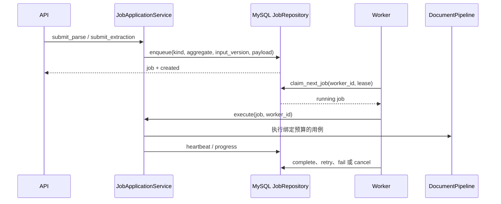

# 持久化后台任务

设计状态：Accepted
实现状态：Implemented
最后更新：2026-07-29
关联代码：`src/axiom_flow/application/jobs.py`、`src/axiom_flow/worker/runner.py`、`src/axiom_flow/worker/__main__.py`
关联测试：`tests/contract/test_design_documents.py`、`tests/integration/test_jobs.py`、`tests/contract/test_code_document_mapping.py`
关联 ADR：`docs/adr/0006-persistent-jobs-and-api-v1.md`

## 提交与执行

## 任务契约

任务类型为 `parse_document`、`extract_knowledge`。任务状态为 `queued`、`running`、`succeeded`、
`failed`、`cancel_requested`、`cancelled`。API 返回稳定 JobResource，不等待模型任务完成。

解析任务的 `input_version` 绑定文档哈希、模型、包含端点的页范围、契约版本、token 上限、页级
尝试次数和实际任务预算；同一活动版本返回既有任务。抽取任务绑定当前已接受页面的 ParseRun 和
知识模型。任务 payload 保存页范围、页数和预算。

## 租约、重试与取消

Worker 使用 MySQL 8 `FOR UPDATE SKIP LOCKED` 领取任务，写入 owner、过期时间和 attempt。心跳只
对持有租约的 `running` 或 `cancel_requested` 任务生效。过期租约在 attempt 未耗尽时回到
`queued`，否则进入 `failed`。

网络超时、网络错误、429 和 5xx 可触发任务重试；其他异常为终止失败。供应商页级重试发生在
任务内部，不能与任务 attempt 混为一谈。排队任务可直接取消；运行任务先变为
`cancel_requested`，在页面边界协作式结束为 `cancelled`。错误只保存类型和截断后的脱敏摘要。
