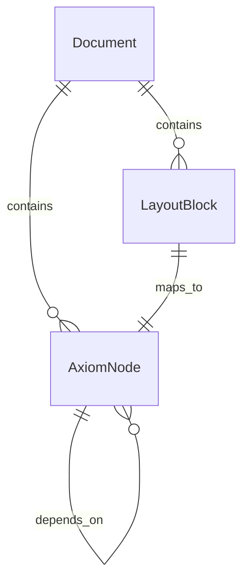

# 数据模型定义

## AxiomNode（核心知识节点）

数学知识的最小原子单元，保留完整的逻辑层级的物理坐标信息。

```python
from pydantic import BaseModel
from datetime import datetime
from typing import Optional

class AxiomNode(BaseModel):
    """核心知识节点"""
    node_id: str                    # UUID
    doc_id: str                     # 所属文档 ID
    node_type: NodeType             # THEOREM | DEFINITION | PROOF | EXERCISE | LEMMA | COROLLARY | TEXT
    content: str                    # Markdown 内容（含 LaTeX）
    title: Optional[str]            # 标题（如 "定理 1.1"）
    page_no: int                    # 起始页码
    bbox: dict                      # 物理坐标 {"x0","y0","x1","y1"}
    parent_id: Optional[str]        # 父节点 ID（用于嵌套结构）
    dependencies: list[str]         # 前置依赖节点 ID 列表
    metadata: dict                  # 扩展元数据
    created_at: datetime
```

## LayoutBlock（布局块）

从 MinerU `layout.json` 直接映射的物理布局块。

```python
class LayoutBlock(BaseModel):
    block_id: str                   # UUID
    doc_id: str
    page_no: int
    block_type: BlockType           # TEXT | FORMULA | TABLE | FIGURE | HEADING
    content: str                    # 文本内容
    latex: Optional[str]            # LaTeX 源码（仅公式块）
    bbox: dict                      # 物理坐标
    confidence: float               # OCR 置信度
    metadata: dict                  # 字体、大小等元数据
```

## Document（文档元数据）

```python
class Document(BaseModel):
    doc_id: str                     # UUID
    title: str                      # 书名/论文标题
    source_path: str                # PDF 源路径
    total_pages: int
    status: DocStatus               # PENDING | PARSING | PARSED | INDEXING | INDEXED | FAILED
    layout_ref: str                 # layout.json 引用路径
    metadata: dict                  # 作者、版本、ISBN 等
    created_at: datetime
    updated_at: datetime
```

## NodeType 枚举

| 类型 | 说明 |
|------|------|
| `THEOREM` | 定理 |
| `DEFINITION` | 定义 |
| `PROOF` | 证明 |
| `EXERCISE` | 习题 |
| `LEMMA` | 引理 |
| `COROLLARY` | 推论 |
| `TEXT` | 普通文本 |

## ER 关系


