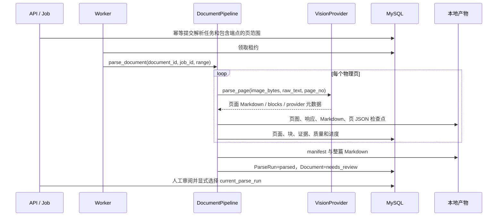

# 文档解析、规范内容与页级审阅

设计状态：Accepted
实现状态：In Progress
最后更新：2026-07-29
关联代码：`backend/infrastructure/config.py`、`backend/infrastructure/bailian.py`、`backend/infrastructure/artifacts.py`、`backend/infrastructure/pdf_pipeline.py`
关联测试：`tests/test_design_documents.py`、`tests/test_document_workflow.py`、`tests/test_v03_jobs.py`、`tests/test_providers.py`、`tests/test_parse_artifacts.py`、`tests/test_code_document_mapping.py`
关联 ADR：`docs/adr/0008-immutable-parse-artifact-bundles.md`、`docs/adr/0010-qwen-ocr-only-rudin-trial.md`、`docs/adr/0011-current-parse-run-and-prunable-artifacts.md`

## 范围与处理顺序

本设计负责不可变 PDF 的导入、页范围解析、规范内容、来源证据、质量信号、页级审阅和解析产物。
知识候选、工作簿和发布契约见[知识审阅与发布](excel-release-workflow.md)。

## 应用端口

| 端口 | 当前契约 |
| --- | --- |
| `VisionProvider` | `parse_page(image_bytes, raw_text, page_no)` 返回页面字典并累计调用量。 |
| `KnowledgeProvider` | `extract_knowledge(markdown)` 返回候选节点和关系；由知识抽取任务调用。 |
| `DocumentPipeline` | `import_pdf`、`parse_document`、`generate_candidates` 三个应用可调用操作。 |

供应商响应只能经 `PDFPipeline` 归一化后进入领域事实。API 进程不调用供应商；Worker 为每个任务
取得绑定预算的 pipeline。

## 页面与证据契约

| 资源 | 当前字段 |
| --- | --- |
| `PageResponse` | `id`、`run_id`、`document_id`、`page_no`、`markdown`、`blocks`、`evidence`、`quality`、`page_kind`、`review_status`、`review_reason`、`image_url` |
| 内容块 | `kind`、`content`、`latex`、`quote`、`order_no`、`bbox`、`confidence`、`source` |
| 来源证据 | `kind`、`page_no`、`quote`、`bbox` |

块顺序由 `order_no` 固定。PyMuPDF 原生文字块携带真实坐标；模型块只在提供合法 `bbox_1000` 或
能匹配原生引用时获得坐标，其他情况保持 `bbox=null`。表格和图片块只有在存在合法坐标时才生成
裁剪图，禁止推测证据位置。

## 路由、降级与失败

当前每个选中页面都调用百炼 `qwen-vl-ocr`，不切换其他模型。`finish_reason`、usage、修复标记和
契约版本进入供应商元数据；截断、空响应和非法结构按页级策略重试。

供应商失败但页面存在非空原生文字时，pipeline 可使用 PyMuPDF 文字和原生块形成带
`parser_error` 风险的可审阅页面，这不是模型切换。扫描页没有原生文字时，供应商失败会使运行
失败。空正文只有在低墨迹页被明确归类为 `blank` 时允许成功。

同一任务重试复用原 ParseRun 和已校验页检查点。正常执行通过 `ParseRunStatus` 收敛为 `parsed`、
`failed` 或 `cancelled`；进程恢复直接把遗留数据库记录写成持久化标记 `interrupted`，同时把文档
标记为 `failed`。`interrupted` 不是 `ParseRunStatus` 可传入的正常结束状态。成功运行只是候选，
只有显式选择并再次校验 manifest 后才成为当前解析结果。

## 质量与人工审阅

当前自动质量统一返回 `needs_review`，只记录三类确定性信号：扫描页没有原生文字层、视觉解析
发生降级、没有识别到内容块；同时保存 `page_kind`、`native_text_chars` 和 `ink_ratio`。自动规则
不修改 Markdown 或知识语义。

人工页面状态为 `accepted`、`rejected`、`reparse_requested`，每次修改追加 ReviewEvent。只有
当前 ParseRun 中 `accepted` 且非参考/可视化类型的页面可进入知识抽取。

## 产物与符合度

共享 200 DPI 页图位于内容哈希下的固定渲染目录；运行私有响应、页 JSON、Markdown、裁剪图和
manifest 位于 `parse-runs/<run-id>/`。manifest v2 区分共享与私有文件并校验哈希，读取器兼容 v1。

**DES-001**：Accepted 目标还包括乱码、版面覆盖、页数、公式和表格缺失等稳定质量信号；当前
实现尚未具备这些规则及回归样本。本文件在该偏差关闭前保持 `实现状态：In Progress`，关闭条件
见[待做任务](../trackers/todo.md)。
