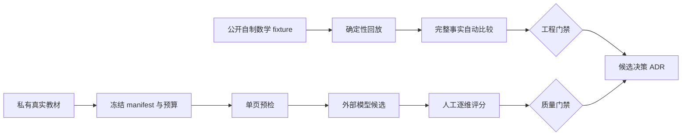

# 解析评测治理

设计状态：Accepted
实现状态：Implemented
最后更新：2026-07-29
关联代码：`evaluation/regression.py`、`evaluation/replay.py`、`evaluation/benchmark.py`、`evaluation/scorecard.py`、`evaluation/preflight.py`
关联测试：`tests/test_evaluation_regression.py`、`tests/test_evaluation_benchmark.py`、`tests/test_evaluation_scorecard.py`、`tests/test_evaluation_preflight.py`、`tests/test_design_documents.py`、`tests/test_code_document_mapping.py`
关联 ADR：`docs/adr/0009-reject-current-rudin-parser-route.md`、`docs/adr/0010-qwen-ocr-only-rudin-trial.md`、`docs/adr/0019-public-fixture-and-private-benchmark-boundary.md`

## 双层门禁

公开确定性回归验证工程契约，私有真实样本评测验证外部模型质量。任一门禁失败时都不得宣称解析
路线合格；replay 不访问外部模型，也不能替代真实教材评分。

## 公开确定性回归

`evaluation/fixtures/` 只接受项目自制或具有明确再分发许可的输入。每个 fixture 必须保存许可证、
源 PDF、SHA-256、页数、人工金标、确定性 replay 输入和 schema 版本。禁止使用版权教材、私有路径
或真实密钥构造公开 fixture。

`evaluation.regression` 校验 schema、源文件哈希、parse manifest 及其文件哈希，并比较整篇与逐页
Markdown、块顺序和类型、公式、表格、内容图片及来源 bbox。文本使用 Unicode NFC、统一换行和
行尾空白规范化；LaTeX 额外压缩空白。bbox 必须在页面范围内，与金标交并比不得低于 `0.75`。
任何检查失败都阻断 CI；报告只包含相对路径、检查项和失败原因。

`evaluation.replay` 使用 fixture 中冻结的页面响应和生产 `ParseArtifactWriter` 生成 schema v2 产物，
不调用模型。重复回放必须得到相同的页面事实和内容哈希。

## 私有模型 benchmark

私有 benchmark 的冻结 manifest 与脱敏结论放在 `evaluation/benchmarks/private/`。PDF、页图、完整
响应和人工工作文件写入 `data/evaluation/runs/<experiment-id>/<run-id>/`，不得提交 Git。

正式 scorecard 固定要求 12 页。允许维度为 `text`、`structure`、`formula`、`table_figure`、
`source_evidence`，每页必须包含 `source_evidence`。默认最大模型调用数为 36，manifest 可以声明
更小预算但不能超过该值。人工对适用维度打 `0`、`1`、`2` 分并给出理由；平均分至少为 1.5，
且公式和来源证据不得为 0，页面不得存在 critical error。

ADR 0010 的 Rudin 20 页工程试跑仍固定 PDF 物理页 20–39、最多 60 次调用并抽检 20、24、29、
34、39 页。它只验证连续运行和局部可审阅性，不覆盖 12 页质量采纳门禁。

## 预检、输出与失败

`evaluation.preflight` 只对一页本地 PDF 调用 `qwen-vl-ocr`，沿用生产页级策略最多尝试三次。
预检报告只保存模型、调用次数、耗时、结构摘要和脱敏错误；通过只表示链路可用。

可提交报告必须记录实验 ID、输入与运行产物标识、脱敏模型配置、调用量、耗时、费用估算、逐页
评分、理由和结论。可确定复现的缺陷进入自动回归或 tracker；外部服务波动标记为外部失败。
任何模型或解析路线变化只有经 Accepted ADR 才能进入生产设计。
