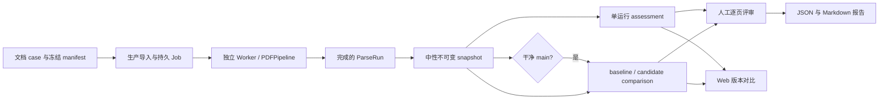

# 文档中心解析评估

设计状态：Accepted
实现状态：Implemented
最后更新：2026-07-30
关联代码：`src/axiom_flow/application/evaluations.py`、`src/axiom_flow/application/evaluation_analysis.py`、`src/axiom_flow/infrastructure/evaluation_workspace.py`、`evaluation/cli.py`、`evaluation/tools/fixture_builder.py`、`evaluation/tools/replay.py`、`evaluation/tools/regression.py`
关联测试：`tests/unit/test_evaluation_comparison.py`、`tests/unit/test_evaluation_assessment.py`、`tests/unit/test_evaluation_cli.py`、`tests/integration/test_evaluation_workspace.py`、`tests/integration/test_evaluation_api.py`、`tests/system/test_public_fixture_regression.py`、`tests/contract/test_design_documents.py`、`tests/contract/test_code_document_mapping.py`
关联 ADR：`docs/adr/0010-qwen-ocr-only-rudin-trial.md`、`docs/adr/0019-public-fixture-and-private-benchmark-boundary.md`、`docs/adr/0020-document-centric-evaluation-workspace.md`、`docs/adr/0022-neutral-evaluation-snapshots-and-assessments.md`

## 目标与边界

评估回答两个不同问题：单次生产解析是否完整且人工质量如何；同一文档的候选运行相对干净 main
基线发生了什么变化。文档 case 是导航边界，中性 snapshot 是不可变输入，assessment 保存绝对质量，
comparison 保存相对差异。评估覆盖 Markdown、blocks/阅读顺序、公式、表格、图片、证据 bbox、
manifest 和运行可靠性，不覆盖知识抽取、工作簿或发布。

公开 fixture 验证确定性工程契约，私有教材验证外部模型质量，两者不能替代。真实调用必须经过
Document/Application、持久 Job、独立 Worker、`PDFPipeline` 和标准 ParseRun；评估代码不能直接
实例化 Provider。



## 目录与事实

```text
evaluation/documents/<case-id>/             # 可提交定义、公开 fixture、私有脱敏元数据
data/evaluation/documents/<case-id>/
  case.json
  source/source.pdf
  runs/<snapshot-id>/run.json
  runs/<snapshot-id>/artifacts/
  assessments/<assessment-id>/assessment.json
  assessments/<assessment-id>/pages/page-NNNN.json
  assessments/<assessment-id>/review.jsonl
  assessments/<assessment-id>/report.{json,md}
  comparisons/<comparison-id>/comparison.json
  comparisons/<comparison-id>/pages/page-NNNN.json
  comparisons/<comparison-id>/review.jsonl
  comparisons/<comparison-id>/report.{json,md}
```

`AXIOM_DATA_DIR` 保存生产 ParseRun，`AXIOM_EVALUATION_DATA_DIR` 保存冻结评估事实。两者可分别隔离，
评估状态不写 MySQL。case ID 使用规范化中文短标题和 PDF SHA-256 前十二位，loader 必须校验完整
64 位哈希、目录后缀和路径语义。JSON 原子替换；JSONL 追加保存人工事件；损坏输入必须明确失败。

## Snapshot 契约

capture 只接受状态为 `parsed`、产物为 `available` 且 manifest 可校验的生产 ParseRun，不改变
`current_parse_run_id`。snapshot 保存 ParseRun ID、来源哈希、页集合、模型与契约、调用数、时间、
Git commit、branch、dirty 和 diff hash，不保存 baseline/candidate 角色。

`baseline_eligible` 只在 branch 为 `main` 且工作树干净时为 true。脏快照必须保存完整 diff hash，
可进入 assessment 或作为 comparison candidate，但不能作为 baseline。快照文件优先硬链接、失败时
复制，并逐文件保存哈希；原 ParseRun 被 prune 后仍必须独立校验。快照目录禁止覆盖。

## Assessment 契约

assessment 创建时冻结 snapshot 和 manifest contract。自动检查只判断 page JSON、页图、非空
Markdown、blocks、evidence 和 bbox 边界，不推断公式语义正确。`execution_status` 与人工
`quality_status` 分开保存，自动完整不能替代人工质量。

`engineering_chain` profile 使用 manifest 指定审阅页和标准，verdict 只允许 `pass`、`failed`、
`needs_review`；报告固定声明 `decision_scope=engineering_chain_only`。未审完时质量只能是
`review_required`，全部指定页为 pass 才是 passed，否则为 failed。

正式 scorecard 固定要求 12 页。允许维度为 `text`、`structure`、`formula`、`table_figure`、
`source_evidence`，每页必须包含 `source_evidence`。默认最大模型调用数为 36；人工逐维使用 0、1、
2 分并给理由，平均分至少为 1.5，公式和来源证据不得为 0，且不得存在 critical error。

## Comparison 契约

comparison 创建时指定 baseline 和 candidate。两者必须来源哈希与页集合相同、快照完整且 ID 不同，
baseline 还必须 `baseline_eligible=true`。逐页保存文本 diff、block 顺序、公式 token、表格矩阵、
图片/caption 和证据变化，不压缩成单一质量分。

无 gold 时自动结论只允许 `no_regression_detected`、`review_required`、`changed`，不得宣称 improved。
相对 verdict 只允许 `candidate_better`、`baseline_better`、`equivalent`、`both_failed`、
`needs_review`。报告从 comparison 和每页最新 review 重建，不修改原始比较事实。

## CLI、API、Web 与失败语义

CLI 可以 materialize 私有来源、冻结 manifest、导入文档、提交 Job、轮询、capture、assess、compare
和 report，但不执行 Worker。等待超时必须返回 Job ID，任务继续留在持久队列供恢复。单页连通性也
使用生产 Job/Worker，不保留直接 Provider 预检入口。

API 提供 case、capture、assessment、comparison、逐页资源、review 和 report，只返回稳定 ID 与
相对 URL。Web 使用“单次质量 / 版本对比”两种模式，只负责浏览、人工结论和报告；不启动模型、
不读取 Git、不捕获快照、不自动选择当前 ParseRun。

case/资源缺失返回 not found；哈希、页范围、baseline 资格、profile 或完整性不满足返回冲突/校验
错误；重复 ID 不覆盖已有目录。可复现缺陷进入 tracker，外部模型失败保存脱敏证据。

## 公开与私有案例

公开 case 必须提交许可、源 PDF、SHA-256、页数、确定性 replay 和期望产物。版权教材只提交来源
哈希、页数、冻结 manifest 和脱敏报告；PDF、页图、完整响应、绝对路径和凭证不得进入 Git。Rudin
工程链路固定先做第 20 页 smoke，再做物理页 20–39，最多 60 次调用，并人工审阅 20、24、29、34、
39 页；该结果不替代正式 12 页模型采纳实验。
