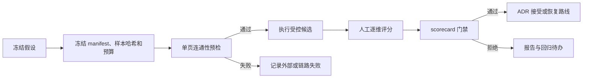

# 解析评测治理

设计状态：Accepted
实现状态：Implemented
最后更新：2026-07-29
关联代码：`evaluation/scorecard.py`、`evaluation/preflight.py`、`evaluation/scanned_textbook.py`
关联测试：`tests/test_design_documents.py`、`tests/test_evaluation_scorecard.py`、`tests/test_evaluation_preflight.py`、`tests/test_scanned_textbook_evaluation.py`、`tests/test_code_document_mapping.py`
关联 ADR：`docs/adr/0009-reject-current-rudin-parser-route.md`、`docs/adr/0010-qwen-ocr-only-rudin-trial.md`

## 决策流程

评测用于判断候选解析路线、模型或提示词是否值得进入生产设计，不修改生产数据，也不替代自动化
测试。

## 连通性预检

`evaluation.preflight` 只对一页本地 PDF 调用 `qwen-vl-ocr`，沿用生产页级策略最多尝试三次。
报告只保存模型、调用次数、耗时、结构摘要和脱敏错误；完整响应保存在被忽略的本地 data 目录。
只有完整结束且可归一化的响应才允许启动正式实验。

## 十二页质量评测契约

scorecard 固定要求 12 页。允许维度为 `text`、`structure`、`formula`、`table_figure`、
`source_evidence`，每页必须包含 `source_evidence`。默认最大模型调用数为 36，manifest 可以声明
更小预算但不能超过该值。

人工对适用维度打 `0`、`1`、`2` 分并给出理由。平均分至少为 1.5，且公式和来源证据不得为 0，
页面也不得存在 critical error，候选才可接受。结果必须记录运行产物标识、脱敏模型配置、调用量、
耗时和费用估算。

## 二十页工程试跑

ADR 0010 的 Rudin 工程试跑使用独立 manifest：PDF 物理页 20–39、最多 60 次调用，并人工抽检
20、24、29、34、39 页。它验证工程链路和局部可审阅性，不覆盖十二页整书路线的质量采纳门槛。

## 结果与失败

实验报告保存 manifest、代码版本、模型配置、逐页评分、预算使用和结论。可确定复现的缺陷进入
对应自动化测试或 tracker；外部服务波动记录为外部失败，不能解释为质量通过或质量拒绝。任何
路线变更只有经 Accepted ADR 才能进入生产设计。
