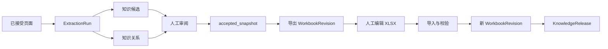

# 知识审阅、工作簿与显式发布

设计状态：Accepted
实现状态：In Progress
最后更新：2026-07-29
关联代码：`src/axiom_flow/application/workbooks.py`、`src/axiom_flow/infrastructure/workbooks.py`
关联测试：`tests/test_design_documents.py`、`tests/test_document_workflow.py`、`tests/test_code_document_mapping.py`
关联 ADR：`docs/adr/0003-excel-publish-source-of-truth.md`、`docs/adr/0005-mysql-runtime-storage.md`

## 工作流

知识抽取只消费当前 ParseRun 中已接受的正文页面。每次抽取创建独立 `ExtractionRun`；候选、关系
和审阅历史保留运行来源，模型输出不能直接发布。

## 候选、关系与审阅

| 资源 | 当前字段 |
| --- | --- |
| 知识候选 | `id`、`document_id`、`extraction_run_id`、`kind`、`title`、`content`、`evidence`、`review_status`、`review_reason` |
| 知识关系 | `id`、`document_id`、`extraction_run_id`、`source_id`、`target_id`、`relation`、`evidence`、`review_status` |
| ReviewEvent | `id`、`target_type`、`target_id`、`status`、`reason`、`created_at` |

候选 `kind` 当前由模型提供，缺失时使用 `concept`，尚未使用封闭枚举。关系只允许
`CONTAINS`、`PREREQUISITE_OF`、`DEFINES`、`PROVES`、`USES`、`ILLUSTRATES`、
`RELATED_TO`。无法定位原引用时仍保存页级上下文证据，不伪造 bbox。

页面和候选审阅状态分别遵守各自协议。发布快照只包含 `accepted` 候选和两端均存在且已接受的
关系。当前没有独立的正式 `KnowledgeNode` 表；Web 中的知识节点资源来自候选记录，正式版本由
KnowledgeRelease 的不可变 snapshot 表达。

## 工作簿契约

| 工作表 | 当前用途 |
| --- | --- |
| `documents` | 必须只有一个与导入目标一致的 `document_id`。 |
| `knowledge_nodes` | 读写节点 ID、类型、标题、正文、证据 JSON 和审阅状态。 |
| `knowledge_edges` | 读写关系 ID、端点、关系类型、证据 JSON 和审阅状态。 |
| `sections` | 当前只创建并要求存在，不读取或持久化数据。 |
| `review_notes` | 当前只创建并要求存在，不读取或持久化数据。 |

导入必须一次性通过工作表、document_id、标题、状态、关系端点、关系类型和证据校验；证据至少
包含一条具有整数 `page_no` 的记录。失败不创建部分草稿，也不修改已发布快照。

## 发布与符合度

`publish_latest` 只发布最新 WorkbookRevision。节点不能为空，所有节点和关系必须是 `accepted`，
关系端点必须存在。每次发布创建新的 `published` KnowledgeRelease，旧 release 保持不可变；查询
按创建时间读取最新 `published` snapshot。Excel 文件变化不会自动同步。

**DES-002**：`sections` 和 `review_notes` 当前是必需但未消费的占位工作表。后续独立计划必须
决定移除它们，或实现字段契约、持久化和校验；在此之前不得宣称章节与审阅备注已接入发布流程。
本文件保持 `实现状态：In Progress`，关闭条件见[待做任务](../trackers/todo.md)。
