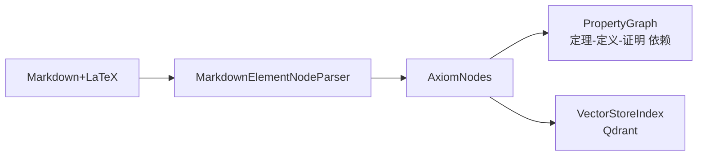

# LlamaIndex 知识索引 Pipeline

> **状态**：Planning (Phase 2)
> **依赖**：Phase 1 MinerU 解析输出

## 流水线

## 待设计内容

Phase 2 启动前需完成以下详细设计：

1. **Heading-Aware Chunking 策略** — 确保定理+证明不跨 chunk
2. **NodeType 识别规则** — 从 Markdown 中自动识别 DEFINITION / THEOREM / PROOF
3. **PropertyGraph 关系定义** — `DEPENDS_ON` / `PROVES` / `EXTENDS` 等边类型
4. **Qdrant 索引 Schema** — embedding 维度、payload 字段、filter 策略
5. **检索排序策略** — 向量相似度 + 元数据过滤 + 图路径加权

详见 `docs/discuss/` 中的技术讨论。
