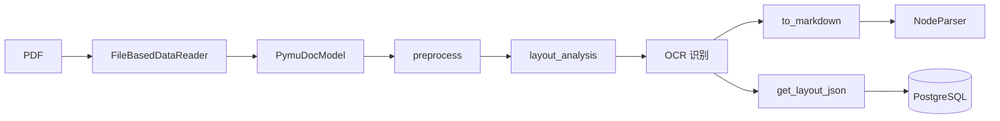

# MinerU 集成方案

## 目标

实现对数学教材 PDF 的高保真解析，保留文本、LaTeX 公式和物理布局坐标。

## 解析流水线



## MinerUService 接口设计

```python
class MinerUService:
    async def parse_pdf(self, pdf_path: str) -> ParseResult:
        """
        解析 PDF，返回结构化 Markdown 和布局 JSON。

        Args:
            pdf_path: PDF 文件绝对路径

        Returns:
            ParseResult:
                - markdown: str            # 含 LaTeX 公式的 Markdown
                - layout_json: dict        # 完整布局信息（含 bbox 坐标）
                - pages: list[PageInfo]    # 每页的元数据
        """

    async def parse_pdf_batch(self, pdf_paths: list[str]) -> list[ParseResult]:
        """批量解析，支持并发"""

    def extract_formulas(self, markdown: str) -> list[FormulaBlock]:
        """
        从 Markdown 中抽取出所有 LaTeX 公式块。

        Returns:
            list[FormulaBlock]:
                - tex: str                 # LaTeX 源码
                - bbox: dict               # 物理坐标
                - page_no: int             # 页码
        """
```

## 布局数据结构 (layout.json)

```json
{
    "page_no": 1,
    "width": 595.28,
    "height": 841.89,
    "blocks": [
        {
            "type": "text",
            "bbox": {"x0": 72, "y0": 100, "x1": 523, "y1": 130},
            "content": "定理 1.1 (介值定理)...",
            "font": "宋体",
            "size": 12
        },
        {
            "type": "formula",
            "bbox": {"x0": 100, "y0": 140, "x1": 500, "y1": 180},
            "latex": "\\lim_{x \\to 0} \\frac{\\sin x}{x} = 1",
            "confidence": 0.95
        }
    ]
}
```

## 输出目录结构

```
data/parsed/
└── {course_number}_{course_name}/
    └── {book_name}/
        ├── {book_name}.md           # 完整 Markdown
        ├── layout.json              # 全局布局索引
        ├── images/                  # 嵌入式图片
        └── pages/
            ├── page_001.md          # 逐页 Markdown
            └── page_001_layout.json # 逐页布局信息
```

其中 `{course_number}_{course_name}` 对应 QED-Tracker 的课程命名约定（如 `01_math_analysis`）。

## 关键约束

1. **Layout Retention**：任何处理步骤严禁丢弃 `bbox`、`page_no` 信息
2. **Formula Integrity**：`[CHECK_REQUIRED]` 标记低置信度公式，禁止脑补
3. **Atomicity**：知识块（如 Theorem 1.1）必须完整保留，不允许在中间切分
