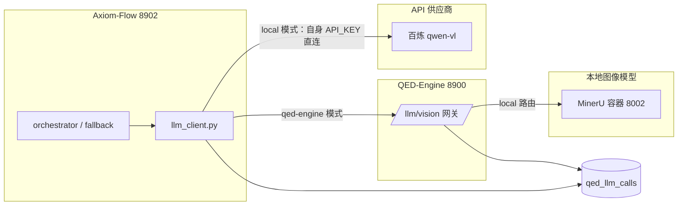

# 模型模式与 MinerU 移交设计（model-mode-config）

设计状态：Accepted
Plan: docs/plans/2026-08-model-mode-and-mineru-gateway.md
Approved-by: 用户评审
实现状态：Implemented
最后更新：2026-08-20
关联代码：`.env`、`src/axiom_flow/llm_client.py`（新增）、`scripts/axiom_flow_service.py`（`--mode` 扩展）、`scripts/compose.yaml`/`scripts/infra-*.ps1`/`scripts/docker/Dockerfile`（迁出根仓库）
关联测试：`tests/unit/test_service_scripts.py`（`--mode` 用例）、llm_client 兼容层单测（实施时新增）
关联 ADR：无（随根仓库 LLM 网关设计执行，实施验证后按需沉淀）
需求方：QED-Engine 根仓库（LLM 网关与模型管理轮，REQ-044，跨项目请求）

## 背景与动机

QED-Engine「LLM 网关与模型管理」轮（根仓库设计
`docs/design/llm-gateway-and-model-management.md`，状态 Accepted）确立三项目统一的模型调用
形态：模型调用统一经 8900 网关（qed-engine 模式）或子项目用自身 `API_KEY` 直连供应商
（local 模式），调用记录统一落 qed 库 `qed_llm_calls` 单表；本地文字模型（LM Studio）与图像
模型（MinerU）的编排统一由根仓库 `scripts/text-model/`、`scripts/image-model/` 托管。Axiom-Flow
侧改造需求登记为根仓库 REQ-044，本设计是本仓库侧的执行方案（当前为草稿，供评审后执行）。

> **跨项目裁决同步（2026-08-20）**：根仓库裁决——逐厂商 key 别名取消，统一 `API_KEY` +
> `QED_API_PROVIDER` 为准；本设计中「AXIOM_API_KEY 降级为别名」表述以根仓库
> `docs/design/configuration-and-secrets.md` 当前约定为准。

现状（实施后）：

- 视觉凭据统一为 `API_KEY`，通过 `QED_API_SELECT`（local|qed-engine）选择调用模式；
- `llm_client.py` VisionClient 提供双模式视觉调用：local 直连 dashscope（独立性铁律），
  qed-engine 经 8900 网关 `/api/v1/llm/vision`；
- MinerU 编排已移交根仓库（`scripts/image-model/`），本仓库过渡期保留双份；
- 调用记录写入 `qed_llm_calls` 表（local 模式由 `llm_client.py` 自写，qed-engine 模式由网关统一写）。

## 设计要点

### 1. `.env` 调整

自身 `.env` 统一为三项目约定变量：

```ini
# ============ 模型模式与密钥 ============
QED_API_SELECT=local          # local（默认，自身 API_KEY 直连供应商）| qed-engine（经 8900 网关）
API_KEY=                      # 统一供应商密钥
QED_LLM_GATEWAY_URL=http://127.0.0.1:8900   # qed-engine 模式读取；local 模式忽略
AXIOM_VISION_MODEL=qwen-vl-plus             # 视觉模型名
```

- 配置来源优先级：真实环境变量 > 自身 `.env` > 父级 `.env` > 默认值；绝不写入 `os.environ`。
- 既有私有变量保留：`AXIOM_VISION_MODEL`、`AXIOM_PORT` 等非密钥配置继续由自身 `.env` 承载。
- 不再有 `AXIOM_API_KEY` 降级别名逻辑；统一使用 `API_KEY`。

### 2. `llm_client.py` 兼容层

新增 `src/axiom_flow/llm_client.py`：对外提供统一视觉调用接口，内部按模式切换，业务调用方
（orchestrator / fallback）代码不变：

| 模式 | 实现 | 说明 |
| --- | --- | --- |
| `local` | 用自身 `API_KEY` 直连百炼 dashscope qwen-vl（QwenVLPlusClient） | 不依赖 8900 在线（独立性铁律） |
| `qed-engine` | HTTP POST 8900 `POST /api/v1/llm/vision` 网关 | MinerU 仅经网关可达；不接触密钥 |

- VisionClient 构造时读取 `QED_API_SELECT` 决定内部实现。
- 模型选择由 `AXIOM_VISION_MODEL` 决定（默认 qwen-vl-plus）。
- 网关调用失败时错误语义透传（超时/5xx/上游失败），由业务调用方按既有兜底策略处理。
- 不再有 fallback/V2-006（用户确认取消）。

### 3. `axiom_flow_service.py --mode local|qed-engine`

`scripts/axiom_flow_service.py` 增加 `--mode local|qed-engine`：

- `start`/`restart` 可传 `--mode`，默认读自身 `.env` 的 `QED_API_SELECT`（`local`）；
- 模式写入运行状态（logs/ 状态文件），重启可换模式；CLI 传入时覆盖 `.env`；
- 端口（8902）、生命周期、健康探测（`/api/v1/health`）与 8900 接入契约不变。

### 4. MinerU 编排移交

MinerU 编排与容器管理移交 QED-Engine 根仓库：

- `scripts/compose.yaml`、`scripts/infra-up.ps1`/`infra-down.ps1`/`infra-status.ps1`/
  `infra-reset.ps1`、`scripts/docker/Dockerfile` 已迁根仓库 `scripts/image-model/`
  （根仓库侧已落位，2026-08-20）；
- 本仓库侧本地 mineru 直连调用删除，后续 MinerU 能力统一经 8900 `/llm/vision` 网关可达；
- **过渡期双份存在可接受**：根仓库完整接管并验证（网关 local 路由可调用 MinerU）后，
  本仓库侧编排脚本再移除（由本仓库执行时删除，避免影响过渡期运行）。

### 5. 调用记录写 `qed_llm_calls`

- local 模式直连调用成功后由 `llm_client.py` 自写 `qed_llm_calls` 表（`service=axiom_flow`）；
- qed-engine 模式调用记录由网关统一写（本仓库无需重复写入）；
- 表契约（字段定义、provider/model/endpoint/status 语义）以根仓库
  `docs/design/llm-gateway-and-model-management.md`（§调用记录表）为准；表结构由根仓库
  Alembic 迁移落地，本仓库只持有 `QED_DB_*` 写权限。

## 调用拓扑



- local 模式：直连供应商（8900 离线不影响解析，独立性铁律不破坏）；
- qed-engine 模式：经 8900 网关，MinerU 仅此路径可达。

## 验证方式

- 单元：`llm_client.py` 模式切换（local/qed-engine，mock 网络）、`--mode` 解析与持久化
  （扩展 `tests/unit/test_service_scripts.py`）、`tests/unit/test_llm_client.py`。
- 契约：`tests/contract/test_design_documents.py` 的 CURRENT_DOCUMENTS 包含本设计文档
  （本仓库门禁要求，实施时同步）。
- 联调冒烟：local 模式直连供应商成功且调用记录落库；qed-engine 模式经 8900 `/api/v1/llm/vision`
  成功；MinerU 仅经网关可达。
- 全量门禁：`pytest tests -q` + `ruff check src tests scripts` 全绿。

## 已解决的待对齐项

- 直连模型名：统一为 `AXIOM_VISION_MODEL`（默认 qwen-vl-plus），与根仓库网关契约对齐。
- V2-006 fallback 取消：用户确认不保留，原 fallback 逻辑迁入 `llm_client.py` local 模式。

## 待对齐

- MinerU 编排移除时机：以根仓库 `scripts/image-model/` 完整接管并验证为准，过渡期双份存在。

## 关联

- 本仓库 todo：V2-014
- 根仓库 todo：REQ-044
- 根仓库设计：`docs/design/llm-gateway-and-model-management.md`
- 上游契约：8900 `POST /llm/vision` 网关、`qed_llm_calls` 表（根仓库 Alembic 迁移）
