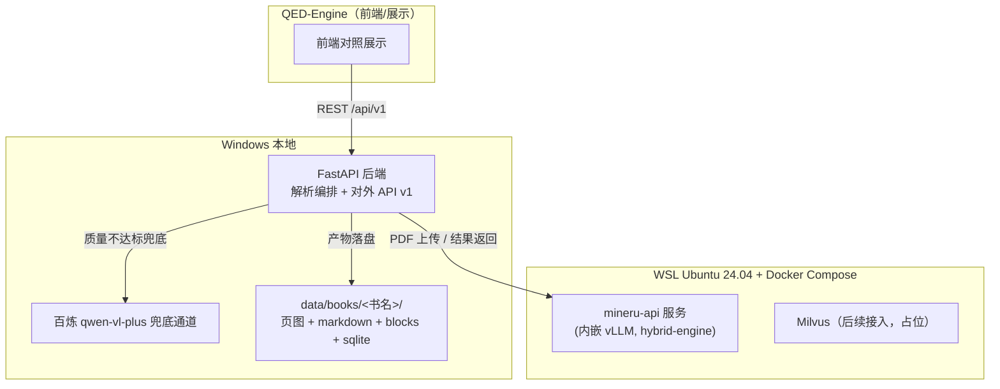

# PDF 解析与渲染（v2 探索基线）

设计状态：Accepted
实现状态：Partial（ingest/schemas 已实现，orchestrator/fallback/api 待对应 V2 任务）
最后更新：2026-08-16
关联代码：`src/axiom_flow/ingest/`、`src/axiom_flow/schemas.py`（其余待实现）
关联测试：`tests/unit/test_ingest.py`、`tests/unit/test_schemas.py`（其余待对应任务）
关联 ADR：无（本设计为探索基线，待实施验证后按需沉淀 ADR）

## 背景与决策记录

2026-08-14 用户裁决：Axiom-Flow 转入探索型重构，与 QED-Engine 合作展示。已下载 12 本数学分析
书籍（`D:\coding\QED-Engine\dataset\qed-tracker\raw\books\math-qe\01_math_analysis`），第一版
聚焦「PDF 完整解析 + 统一格式 + 高还原展示」的**后端解析能力**，前端展示由 QED-Engine 负责。

关键决策：

| 维度 | 决策 |
| --- | --- |
| 重构策略 | 推倒重来：旧代码与 115+ 测试不沿用，git 历史与 docs/history 保留作经验参考 |
| 第一版范围 | 解析 + 渲染数据供给；Milvus/LangChain/知识图谱/数学解析器列为后续探索项 |
| 解析引擎 | MinerU vlm/hybrid 后端（mineru-api 单体：内嵌 vLLM + MinerU2.5 VLM，OmniDocBench 95.39） |
| 兜底通道 | MinerU 质量不达标时按页调用百炼 qwen-vl-plus，标记 source 区分 |
| 展示形态 | 对照模式：原页高清图 + 解析重渲染，由 QED-Engine 前端实现 |
| 首批书目 | 2 本代表样本（Rudin 英文 + 陈纪修中文）跑通验收后批量处理其余 10 本 |
| 持久化 | 文件系统 + 轻量 SQLite（`data/books/<book_id>/`），Milvus 后续接入 |
| 部署 | 分层混合：WSL Docker Compose 容器化（mineru-api 单体，后续 Milvus），Windows 本地跑编排层与 API |
| 前端 | QED-Engine 负责；本仓库只保证 API 契约与产物格式稳定 |

## 总体架构



依赖关系：Windows 应用层 → WSL 推理服务只经 HTTP 双向调用（PDF 上传、解析结果返回），WSL
不直接读写 Windows 文件系统（避免 `/mnt/d` 慢路径），产物一律由 Windows 编排层落盘
`data/`。容器化边界：仅推理服务（GPU 密集型、依赖复杂）进容器；应用层留在 Windows（开发
调试顺手、QED_env 现成）。

## 对外 API 契约草案

| 端点 | 用途 |
| --- | --- |
| `POST /api/v1/parse-jobs` | 提交解析任务（book_id、页范围、策略 local/hybrid） |
| `GET /api/v1/parse-jobs/{id}` | 任务状态与进度 |
| `GET /api/v1/books` | 书目列表（含解析进度） |
| `GET /api/v1/books/{id}/pages/{no}` | 核心：单页完整数据（原页图 URL + 解析 markdown/LaTeX + blocks 坐标 JSON） |
| `GET /api/v1/books/{id}/manifest` | 产物清单（页图、文件哈希） |

兜底策略：解析任务按页产出质量信号，低于阈值或任务配置 `strategy=hybrid` 的页面调
qwen-vl-plus 重解析并标记来源 `mineru|qwen-vl-plus`。

## 数据模型与产物格式

```
data/books/
└── <book_id>/                    # 如 01-rudin-en-principles-of-math-analysis
    ├── book.json                 # 元数据：书名/作者/页数/SHA-256/解析策略
    ├── state.sqlite              # 轻量状态：任务、页状态（pending/parsed/fallback/failed）
    ├── pages/
    │   ├── p0001.png             # 原页高清图（150 DPI 以上，QED-Engine 对照左栏）
    │   ├── p0001.md              # 页级统一 Markdown（人类可读+可再渲染）
    │   └── p0001.blocks.json     # 结构化块（机器可读，Milvus 切分点）
    └── manifest.json             # 产物清单（文件路径+大小+哈希，防篡改/增量）
```

每页三件套：`blocks.json`（核心结构化数据，QED-Engine 渲染 + 后续向量化共同基座）、`md`
（页级统一 Markdown，公式以 `$$...$$`/`$...$` 内嵌，KaTeX/MathJax 可渲染）、`png`（原页高清
渲染，坐标换算基准）。

`blocks.json` 结构（块类型枚举：`heading / paragraph / formula / table / image / list /
caption / header / footer / page_number`）：

```json
{
  "page": 1,
  "source": "mineru",
  "blocks": [
    {"type": "heading", "level": 1, "text": "1. The Real and Complex Number Systems",
     "bbox": [72, 54, 540, 80]},
    {"type": "paragraph", "text": "We assume...", "bbox": [72, 96, 540, 132]},
    {"type": "formula", "latex": "x + y = y + x", "display": true,
     "bbox": [72, 150, 540, 175], "confidence": 0.97},
    {"type": "table", "html": "<table>...</table>", "bbox": [72, 200, 540, 300]},
    {"type": "image", "path": "images/p0001_im1.png", "caption": null, "bbox": [...]}
  ]
}
```

设计预留：blocks 的 `paragraph/formula/table` 块即 Milvus 天然切分点（块级向量化，无需
LangChain 文本切分器）；`formula.latex` 字段为数学解析器探索入口；块类型 + text 支持后续
定义/定理语义识别（知识图谱探索）。

## 组件职责

### 编排层（Windows / FastAPI，Python 3.12）

| 模块 | 职责 |
| --- | --- |
| `api/` | 对外 `/api/v1` 路由，只做协议适配，不掺业务 |
| `orchestrator/` | 解析任务编排：接收 job → 逐页调 MinerU → 校验质量 → 需要时走兜底 → 产物落盘 → 更新 state.sqlite |
| `ingest/` | PDF 导入：渲染页图（150 DPI+）、生成 book.json（含 SHA-256）；源 PDF 留在 `dataset/` 只读不复制（sha256 保证校验） |
| `fallback/` | qwen-vl-plus 客户端（复用现有百炼凭据配置），输出归一化为同一 blocks 结构 |
| `schemas.py` | 统一格式 Pydantic 模型（blocks/page/book/job）——内外契约单一事实源 |

与旧代码关系：全新包结构，旧 `pdf_pipeline/bailian/mysql` 等全部不引入，仅参考其配置与百炼
凭据接入方式。

### MinerU 接入（WSL / Docker Compose）

- `mineru-api`（官方镜像，内嵌 vLLM 推理引擎；`POST /file_parse` 同步返回解析结果，
  多文件字段名 `files`；另有 `POST /tasks` 异步）；实测版本 3.4.4，`backend=hybrid-engine`
- 数据流：Windows 编排层经 HTTP 上传 PDF → WSL 内解析 → 结果经 HTTP 返回 → 编排层落盘
  `data/books/<book_id>/`
- 模型：MinerU2.5 VLM，模型固化在镜像内（`MINERU_MODEL_SOURCE=local`，约 4.6GB 缓存）；
  容器不挂载 Windows 盘，文件交互经 HTTP 上传
- 第一版固定：单 PDF 顺序页解析（`pipeline` 流式落盘）；GPU 穿透 `--gpus all`
- 部署实测：router 模式（`mineru-router`，独立 vLLM worker）在本环境 worker 502 循环重启
  不可用，采用单体 `mineru-api`；镜像与模型下载在 WSL 侧一次性完成（构建时拉取）

### 兜底通道（qwen-vl-plus）

- 触发：页级质量信号不达标（空块率高 / formula 置信度 < 阈值 / 解析失败）+ 任务策略为
  `hybrid` 时
- 输入：该页原图（复用 p0001.png）+ 页码提示；输出：归一化 blocks（同一枚举，
  `source=qwen-vl-plus`）
- 阈值与触发规则第一版可配置化（`config.yaml`），先粗后细

### 启停脚本（Windows PowerShell 包装）

```
scripts/
├── infra-up.ps1      # wsl docker compose up -d（mineru-api）+ 等待健康
├── infra-down.ps1    # 优雅停止（down，容器重建不重新下载模型——模型在镜像内）
├── infra-status.ps1  # 容器健康检查 + GPU 可见性 + 端点探测
├── infra-reset.ps1   # 删除容器（模型在镜像内；重建镜像才重新下载）
├── smoke-api.sh      # 冒烟链路：health + 真实 PDF 端到端解析（docker cp 进容器执行）
└── compose.yaml      # 服务定义（mineru-api 端口 8002、GPU 穿透、健康检查）
```

### 明确不做（第一版）

- 检索/向量化/知识图谱/数学解析器（仅预留字段）
- 多书并发、断点续跑页级任务（job 幂等即可）
- QED-Engine 前端对接联调（只保证 API 契约与产物格式稳定）

## 错误处理与质量验收

### 错误处理

| 场景 | 行为 |
| --- | --- |
| MinerU 单页失败（超时/空输出/异常） | 重试 1 次 → 仍失败标记 `failed`，job 不中断，汇总报告列出失败页 |
| 页质量信号不达标 | 走兜底通道（strategy=hybrid 时）；纯 local 策略标记 `fallback_skipped` + 记录原因 |
| 兜底也失败 | 页标记 `failed` 保留原因，可单独重跑单页（job 支持页范围） |
| vLLM/容器未启动 | 编排层启动前健康检查，返回 503 + 提示运行 `infra-up.ps1` |
| 电源中断/进程被杀 | state.sqlite 页状态持久化 → 重启后按状态续跑未完成页（幂等） |
| WSL 不可达 | API 层错误映射为可读中文错误信息，不泄漏堆栈 |

质量信号（每页随 blocks.json 落盘）：空块率、formula 平均置信度、table 解析成功数、页文本
长度与原生文本长度比值（扫描件无原生文本则跳过）。

### 验收标准

1. 2 本代表书（Rudin 英文 + 陈纪修中文）全流程跑通：导入 → 解析 → 产物落盘
2. 页级质量：抽查每本 20 页（首/中/尾 + 公式密集页），公式 LaTeX 可被 KaTeX 正确渲染 ≥ 90%
   （人工抽查），块类型标注无明显错乱
3. API 契约：`/api/v1` 全部端点按草案可用，返回结构与 schemas 一致
4. 兜底通道：构造低质量页（如手写笔记扫描页），验证 qwen-vl-plus 兜底触发与 source 标记
5. 启停脚本：`infra-up/down/status` 幂等可用，down 后容器重建恢复快（模型在镜像内不重下）
6. 失败恢复：kill 编排进程后重启，未完成页续跑成功

### 测试策略（探索项目，分层但轻量）

| 层 | 内容 | 工具 |
| --- | --- | --- |
| 单元 | schemas 校验、质量信号计算、产物文件名/哈希、状态机转换 | pytest |
| 集成 | 编排层对 WSL 服务的调用（mock 服务代替，CI 无 GPU） | pytest + mock |
| 冒烟 | 真实调用：单 PDF 小样（5 页含公式）跑通全链路 + 兜底触发 | pytest + `@smoke`，本地手动跑 |
| 契约 | API 返回结构与 schemas 一致性、产物三件套完整性 | pytest（轻量） |

不沿用旧 115+ 测试；本地门禁 `pytest + ruff`（不引入远端 CI）。

## 备注

本设计为探索性基线，实现中允许按实际情况调整（技术选型、端口、产物字段等），调整时同步
更新本文档与后续计划。
