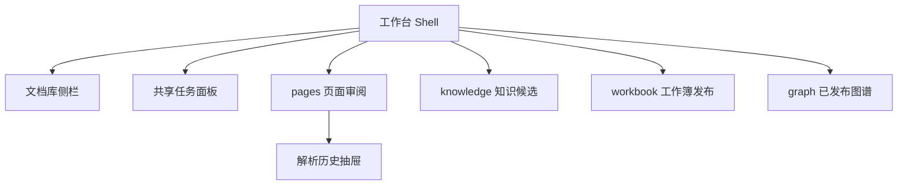

# Web 与 API v1 工作台

设计状态：Accepted
实现状态：Implemented
最后更新：2026-07-29
关联代码：`src/axiom_flow/main.py`、`src/axiom_flow/api/main.py`、`src/axiom_flow/application/reviews.py`、`web/index.html`、`web/style.css`、`web/app.js`
关联测试：`tests/test_design_documents.py`、`tests/test_v03_api.py`、`tests/test_code_document_mapping.py`
关联 ADR：`docs/adr/0006-persistent-jobs-and-api-v1.md`、`docs/adr/0011-current-parse-run-and-prunable-artifacts.md`、`docs/adr/0018-src-package-and-application-owned-workflows.md`

## 工作台结构

文档库侧栏负责导入和选择文档；任务面板跨视图显示当前任务、进度和取消；主工作区只有
`pages`、`knowledge`、`workbook`、`graph` 四个 tab。历史抽屉属于页面审阅的辅助界面，不是
独立主视图。

## 视图行为

| 视图 | 当前能力 |
| --- | --- |
| `pages` | 选择当前 ParseRun，按页对照页图与 OCR，切换阅读/Markdown/Blocks，审阅页面并下载产物。 |
| `knowledge` | 提交抽取任务，审阅候选节点、关系和页级证据。 |
| `workbook` | 导出、下载、导入并校验草稿，显式发布最新 revision。 |
| `graph` | 读取并以原生 DOM 展示最新已发布 snapshot。 |

页面工作区一次只加载一个页面资源，支持页导航、问题筛选、适合宽度和缩放。解析历史默认折叠，
`pruned` 运行只显示摘要。当前没有坐标覆盖层、结构化工作簿差异预览或图形布局引擎。

## HTTP 与文件边界

HTTP 统一使用 `/api/v1`。文档导入返回 `201`；解析和抽取命令返回 `202` Job 资源；Web 轮询任务
状态。当前解析结果只能由带原因的显式选择命令改变。页图、工作簿和产物内容使用后端文件响应，
浏览器不读取数据库、本地绝对路径或百炼凭证。

API 负责请求校验、资源表示和错误翻译，模型任务只由 Worker 执行。文档、任务、审阅和发布操作
全部通过应用服务访问；API 不取得 repository，也不解析数据库保存的本地路径。
