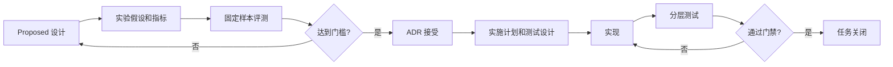

# 任务生命周期

状态：Current  
最后更新：2026-07-27

## 流程

## 阶段门槛

| 阶段 | 必须产物 | 退出条件 |
| --- | --- | --- |
| 讨论 | `Proposed` 设计 | 范围、候选方案、风险、接口与待验证假设明确。 |
| 实验 | manifest、结果、报告 | 固定样本、预算、评分量表和采纳门槛均已执行。 |
| 决策 | ADR | 明确采纳或拒绝，并链接实验报告。 |
| 实施 | 计划与测试设计 | 变更范围、回滚方式、测试命令和完成条件明确。 |
| 关闭 | 测试结果与任务记录 | 适用门禁通过，失败样本已沉淀或分类。 |

主链重构只可在数据契约和解析路由 ADR 接受后开始。当前 v0.1 主链作为历史基线，
不承担向新架构提供长期兼容的责任。
