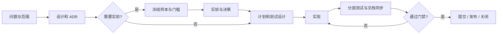

# 任务生命周期

状态：Current  
最后更新：2026-07-27

## 变更分类

| 类型 | 示例 | 必须门禁 |
| --- | --- | --- |
| A 文档/低风险维护 | 中文说明、链接、无行为重命名 | 文档审阅、定向检查。 |
| B 确定性实现 | 状态机、API、迁移、重构 | 设计/ADR、测试设计、实现、分层测试。 |
| C 实验性决策 | 模型、提示词、解析路由 | 冻结实验、评分、ADR，再进入 B。 |
| D 发布/数据操作 | 数据重建、正式发布、远端推送 | 备份/回滚、全量门禁、人工复核。 |

不是所有任务都需要实验。只有结果依赖外部模型质量或存在不可由确定性测试回答的方案取舍时，
才进入实验阶段。

## 流程

## 阶段门槛

| 阶段 | 必须产物 | 退出条件 |
| --- | --- | --- |
| 讨论 | 设计或 ADR | 当前事实、范围、接口、风险、兼容与回滚明确。 |
| 实验（可选） | manifest、结果、报告 | 固定样本、预算、评分量表和采纳门槛均已执行。 |
| 决策 | ADR | 明确采纳或拒绝，并链接实验报告。 |
| 实施 | 计划与测试设计 | 变更范围、回滚方式、测试命令和完成条件明确。 |
| 关闭 | 测试结果、映射与任务记录 | 适用门禁通过，失败已沉淀，提交可独立回滚。 |

主链重构只可在数据契约和解析路由 ADR 接受后开始。当前 v0.1 主链作为历史基线，
不承担向新架构提供长期兼容的责任。
