# 文档体系范本对齐设计（docs-restructure-alignment）

> 归档说明：Superseded（V2-015 执行完毕，2026-08-21）。本任务已按设计落地：architecture/
> 固定化（api.md / database-design.md / code-map）、adr/index v0.1 版本声明、design/ 三态梳理、
> 契约测试同步。文档体系持续维护转长期任务 V2-016（版本末期规范化重新整理一轮）。历史资料
> 只解释背景，不覆盖当前设计。

设计状态：Superseded
实现状态：Completed
最后更新：2026-08-21
需求方：QED-Engine 根仓库（REQ-002 文档治理，依据 ADR 0010 文档体系分层与版本治理）
关联代码：无（本任务仅涉及文档结构调整，不改动功能代码）
关联测试：`tests/contract/test_design_documents.py`（architecture/design/guides 目录集合与元数据门禁）
关联 ADR：`docs/adr/0001-v2-exploration-direction.md`

## 架构示意

```mermaid
graph TD
    A[确定文档 architecture/] --> A1[overview.md 服务架构]
    A --> A2[api.md 8902 接口]
    A --> A3[database-design.md af_* 数据库]
    A --> A4[code-map.md 模块映射]

    B[相对确定 design/] --> B1[pdf-parsing-and-rendering.md]
    B --> B2[model-mode-config.md]
    B --> B3[其他设计文档]

    C[实时状态 trackers/] --> C1[todo.md 任务清单]
    C --> C2[completed.md 已完成归档]

    D[确定文档 guides/] --> D1[development.md 开发指南]
    D --> D2[operations.md 运维指南]
    D --> D3[deployment.md 部署指南]

    E[确定文档 adr/] --> E1[index.md 版本声明]
    E --> E2[N-xxxx-*.md 决策记录]
```

## 背景

QED-Engine 根仓库于 2026-08-20 通过 [ADR 0010](https://github.com/QED-Engine/qed-engine/blob/main/docs/adr/0010-documentation-versioning.md)
确立文档体系三层结构：**确定文档（architecture/）／相对确定（design/）／实时状态（trackers/）**，
并以 QED-Engine 为范本调整 Axiom-Flow、QED-Tracker 两个子项目的文档体系。用户裁决：子项目
调整由本仓库执行（根仓库只建设计文档与 todo 登记）。

本仓库现状：`architecture/` 有 overview.md（服务架构）、code-map.md；`guides/` 已有
operations.md + development.md；缺固定 API 接口文档与 af_* 数据库设计文档。

## 目标

1. `architecture/` 只放确定文档：overview.md（服务架构文档）+ **新增 8902 API 接口文档**
   （api.md）+ **新增 af_* 数据库设计文档**（database-design.md）+ code-map.md。
2. API 接口文档按 QED-Engine 长期任务「API 接口开发」分类（REQ-046）落位，Axiom-Flow 四类：
   ① 自身服务生命周期（启停/重启/健康检测）；② 数据查询（af_* 数据库知识）；③ 解析结果与
   PDF 对照；④ 未来 RAG / 知识图谱预留接口设计。
3. `adr/index.md` 声明当前版本（本仓库沿用自身纪元，如 v2）。
4. `design/` 三态梳理：已完成使命的文档（如 pdf-parsing-and-rendering 拆分后的历史留档）
   按根仓库范本标 Superseded / 移入 history。
5. `trackers/` 主线归并：本仓库无 project-status（不涉及移动）；按根仓库范本在 todo 标注
   主线归属。
6. 契约测试同步更新（architecture 目录集合、design 目录集合、guides 集合等）。

## 范围与非目标

- 范围内：文档结构调整、索引与链接更新、本仓库契约测试同步（代码）。
- 非目标：不改动任何功能代码；不迁移数据；不提交 git（由本仓库自身执行提交）。

## 验证与回执

- 门禁：`pytest tests -q` + `ruff check src tests` + `tests/contract/` 全绿。
- 回执根仓库 REQ-002 / REQ-046（提交号 + 门禁输出）。

## 执行人

本仓库（Axiom-Flow）按 todo 登记执行；执行前先由用户评审本设计。
