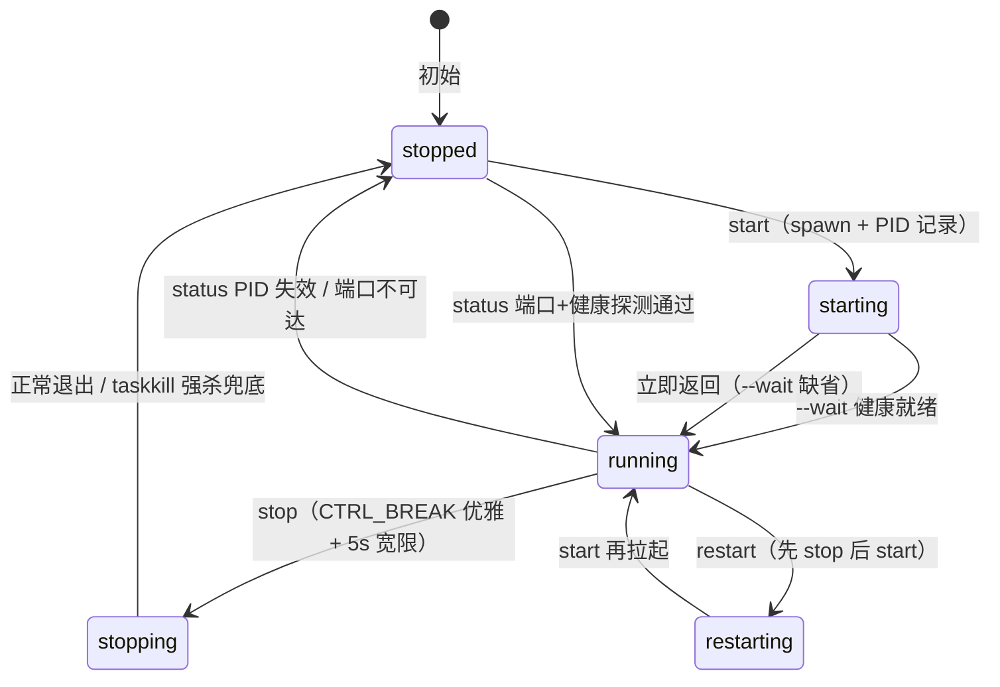

# 服务生命周期脚本设计（service-lifecycle）

> 归档说明：Superseded（v0.1 版本文档体系对齐，V2-015）。服务生命周期契约已固定落位于
> `docs/architecture/api.md` ①生命周期与健康分类；本文件保留脚本设计与平台约束的演进记录。
> 历史资料只解释背景，不覆盖当前设计。

设计状态：Superseded
实现状态：Implemented
最后更新：2026-08-17
关联代码：`scripts/axiom_flow_service.py`、`src/axiom_flow/api/main.py`（`/api/v1/health`）
关联测试：`tests/unit/test_service_scripts.py`、`tests/contract/test_api_v1_contract.py`
关联 ADR：无（v2 探索纪元既有契约，不新增 ADR）

## 背景与目的

Axiom-Flow 以 8902 HTTP 服务运行，启动命令为 `python -m uvicorn axiom_flow.api.main:app`。
根仓库 8900 控制中心此前直接 `Popen` 托管本服务（`service_manager.py` 的 axiom 单元，命令为
v1 时代的 `axiom_flow.main:app` / `axiom_flow.worker`，v2 推倒后已失效），启动/停止/重启的
实现细节散落在根仓库，本仓库自身没有正式、可复用的生命周期入口（对齐根仓库 REQ-017①）。

本设计在本仓库内提供**唯一、自含的生命周期脚本** `scripts/axiom_flow_service.py`：负责解释器
继承、后台拉起、PID 记录、优雅停止与强杀兜底、健康等待与状态探测。根仓库只需黑盒调用
`python scripts/axiom_flow_service.py start|stop|restart`，不再需要持有子进程句柄或复制进程
管理逻辑。**同类启停脚本一律放置于 `scripts/` 目录**，本脚本即范本。



## 脚本接口契约

单文件纯标准库（无第三方依赖），子命令：

```text
python scripts/axiom_flow_service.py {start|stop|restart|status} [--port PORT] [--wait [SECONDS]]
```

- `start`：默认拉起进程后立即返回；`--wait [SECONDS]` 时轮询 `/api/v1/health` 直到就绪
  （默认超时 30s）。已运行（PID 存活或端口探测通过）时报 `already running`，幂等退出 0。
  成功输出 `pid: <n>` 与 `log: <path>`。
- `stop`：读取 PID 文件 → `CTRL_BREAK_EVENT` 优雅停止 → 5s 宽限 → `taskkill /PID /T /F` 强杀
  兜底 → 删除 PID 文件。无 PID 或进程已死时清理残留并幂等退出 0。
- `restart`：先 stop 后 start，透传 `--wait`。
- `status`：PID 存活 / 端口探测（socket 预检 + HTTP 健康确认）双路径，输出
  `running (pid <n>)` / `running (port probe <port>)` / `stopped`，信息型恒退出 0。
- `--port`：health 探测端口，优先级 `--port` > `QED_AXIOM_URL`（仿根仓库 `_port_of` 解析）>
  `AXIOM_PORT` > 8902；`uvicorn` 监听端口随同 `--port` 解析结果（当前固定 8902）。

退出码：`0` 成功或幂等；`1` 运行失败（spawn 失败、`--wait` 健康超时）；`2` 参数错误（argparse）。

## 运行事实

```text
Axiom-Flow/
├── scripts/axiom_flow_service.py   # 生命周期脚本
└── logs/                           # 已 gitignore，运行产物
    ├── qed-axiom.pid               # PID 文件（纯 PID 文本，根仓库 _read_pid_file 兜底约定）
    └── qed-axiom-serve.log         # 子进程 stdout/stderr（uvicorn 访问与未捕获异常）
```

子进程命令 = `sys.executable -m uvicorn axiom_flow.api.main:app --host 127.0.0.1 --port <port>`，
工作目录为仓库根。环境：脚本从仓库根向上查找 `.env`，`setdefault` 注入 `AXIOM_*` 与供应商 key
（`AXIOM_API_KEY`/`QWEN_API_KEY` 等），已有环境变量不覆盖——standalone 启动不缺凭据，调用方
（8900 控制中心）注入环境时保持原样。

健康端点 `GET /api/v1/health` 返回 200（`{"status": "ok"}`）：8900 控制中心与根仓库
`start-all.ps1` 探测 8902 均使用该路径，脚本 `--wait`/`status` 复用同一就绪判据。

## 与 8900 控制中心接入契约

根仓库 `service_manager.py` 的 `axiom` 单元可改造为调用本脚本（根仓库侧实施，另行安排；
本仓库只冻结脚本契约）：

| 操作 | 根仓库调用 | 结果来源 |
| --- | --- | --- |
| start | `python scripts/axiom_flow_service.py start`（workdir=Axiom-Flow） | stdout 首行 `pid: <n>` 或读 `logs/qed-axiom.pid` |
| stop | `python scripts/axiom_flow_service.py stop` | 脚本自含优雅停止 + 强杀兜底，退出码 0 |
| restart | `python scripts/axiom_flow_service.py restart` | 同上 |
| 状态 | 8900 既有端口探测不变（socket + HTTP，不调用脚本） | — |

- 脚本**自含完整生命周期**（PID 文件 + 优雅停止 + 强杀兜底），8900 无需再持有 Popen 句柄；
  现有 `_start_via_script`/`_stop_via_script`/`_read_pid_file`（`qed-{name}.pid` 约定）可直接复用。
- 8900 的启动/停止过渡窗口（15s）、端口探测、并发 409 语义均不变；停止未运行服务的幂等
  由 8900 现有探测先行判断（脚本侧 stop 对未运行也幂等退出 0）。
- 环境继承：8900 以自身进程环境调用脚本（根 `.env` 已注入），脚本侧 `_load_env` 兜底独立
  启动场景。
- 8900 现有 axiom 单元的 `commands`（`axiom_flow.main:app` / `axiom_flow.worker`）为 v1 时代
  残留，v2 已失效；切换为 lifecycle_script 后一并废弃（根仓库侧执行）。

## 平台约束

- Windows 下 `os.kill(pid, 0)` 会直接 TerminateProcess，进程存在性检测一律用
  `tasklist /FI "PID eq <pid>"`。
- 优雅停止用 `signal.CTRL_BREAK_EVENT`（子进程以 `CREATE_NEW_PROCESS_GROUP` 拉起，uvicorn
  捕获 KeyboardInterrupt 优雅收尾），5s 宽限后 `taskkill /PID /T /F` 强杀兜底。无交互控制台
  环境（服务/管道调用）下 `os.kill(CTRL_BREAK)` 抛 SystemError（包裹 WinError 87）——
  脚本捕获 `(OSError, SystemError)` 直接走 taskkill 强杀兜底并标注 `(forced)`，不崩溃。
- 非 Windows 平台回退：`NEW_PROCESS_GROUP = 0`、`CTRL_BREAK_EVENT = SIGTERM`，强杀回退
  SIGKILL 语义由 `_kill_tree` 的 taskkill 调用在非 Windows 下直接失败吞掉（Windows 专属部署）。

## 验证

- 定向测试 `tests/unit/test_service_scripts.py`（23 用例）：tmp 目录 + monkeypatch 隔离 PID/日志
  路径与系统调用，覆盖 parser、start 幂等/spawn/PID 写入/`--wait` 健康与超时、stop 无 PID/
  stale 清理/优雅/强杀兜底/SystemError 兜底、restart 顺序、status 双路径、退出码、
  `QED_AXIOM_URL`/`AXIOM_PORT` 默认端口与 `_load_env` 注入。
- 契约测试 `tests/contract/test_api_v1_contract.py`：`/api/v1/health` 返回 200。
- 全量门禁：`pytest tests -q` + `ruff check src tests` 全绿。
- 手动冒烟：`python scripts/axiom_flow_service.py start --wait` → `GET /api/v1/health` 200 →
  `status` → `restart --wait` → `stop` → `status stopped`。
