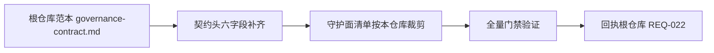

# 治理契约范本对齐（ALN-008，承接根仓库 REQ-022）

设计状态：Accepted
实现状态：Pending
最后更新：2026-08-10
关联代码：无（治理文档，不映射具体模块）
关联测试：`tests/contract/test_standard_governance.py`、`tests/contract/test_test_suite_governance.py`
关联 ADR：`docs/adr/0015-standards-as-governance-source.md`
需求方：QED-Engine（根仓库 REQ-022，范本依据根仓库 `docs/standards/governance-contract.md`）
执行方：Axiom-Flow
接口面：治理契约测试的结构与门禁（契约头六字段、守护面清单、编写约定），不涉及解析接口与数据布局
评审方：用户
验收标准：见下「成功标准」

## 背景

根仓库 ADR 0006 将治理契约设计显式化为可移植范本（守护面清单七类、契约头六字段、编写约定
与新增流程），子项目按其文档体系适配（`ROOT` 推导、DesignRef 指向自身标准、ADR 独立编号、
守护面按目录裁剪），对齐以跨项目请求推进。根仓库已登记 REQ-022（2026-08-09 用户确认范本化
设计）。

本仓库 `tests/contract/`（如 test_plan_governance.py、test_standard_governance.py、
test_adr_governance.py、test_architecture_documents.py、test_design_documents.py、
test_code_document_mapping.py）已按守护面分布，但契约头六字段与守护面归属未按范本统一声明。

## 对齐流程

## 变更内容

1. **契约头六字段**：各契约测试补齐模块职责、设计关联（DesignRef，指向本仓库标准，可为
   多行）、实现状态、被测代码、守护面、失效后果 docstring。
2. **守护面清单裁剪**：按本仓库文档体系与代码库适配守护面七类清单；零网络、纯标准库、
   自包含约定保持不变。
3. **新增流程采纳**：后续新增守护测试按范本流程（guardian 面清单扩展时先更新范本指明的
   清单）。
4. 对齐以本仓库门禁全绿为验收，不改变既有守护逻辑。

## 成功标准

- `tests/contract/` 守护测试全部声明契约头六字段（DesignRef 指向本仓库标准文档）。
- 对齐后全量门禁（pytest + ruff）全绿。
- 回执根仓库 REQ-022（提交号 + 测试输出）。