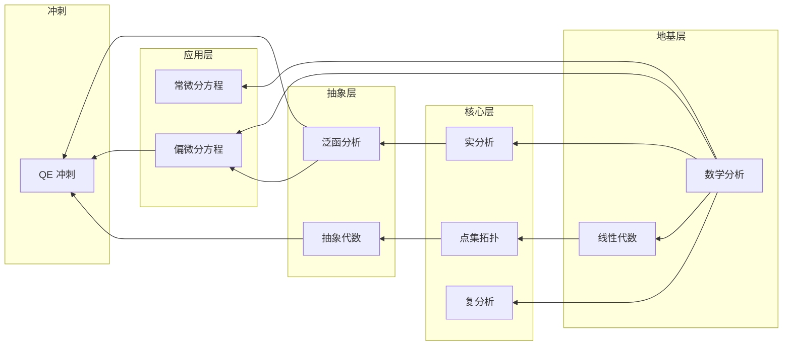

# 知识依赖关系图

## 课程先修关系

基于 QED-Tracker 的 10 门学科框架，Axiom-Flow 的知识依赖关系如下：



## 知识块级依赖（AxiomNode 粒度）

在 AxiomNode 级别，依赖关系反映数学概念的逻辑链路。Phase 2 实现时将以此为指导设计 PropertyGraph 的边类型。

### 依赖边类型

| 边类型 | 含义 | 示例 |
|--------|------|------|
| `DEPENDS_ON` | 概念依赖：后置节点依赖前置节点的概念 | 极限 → 介值定理 |
| `PROVES` | 证明关系：证明节点指向定理节点 | 证明(介值定理) → 介值定理 |
| `APPLIES` | 应用关系：习题应用定理 | 介值定理 → 习题 4.10 |
| `EXTENDS` | 扩展关系：引理扩展为定理 | 引理 2.1 → 定理 2.2 |
| `REFERENCES` | 引用关系：引用其他节点 | 定理 3.1 → 定理 1.1 |

### 典型链路示例

**数学分析链路 (Rudin)：**
```
Definition: 极限(DEF_001)
  → Theorem: 极限运算法则(THM_005)
    → Theorem: 介值定理(THM_012)
      → Exercise: 介值定理应用(EX_045)
      → Theorem: 一致连续性(THM_018)
        → Definition: 一致连续(DEF_015)
```

**线性代数链路 (Axler)：**
```
Definition: 向量空间(DEF_001)
  → Definition: 线性变换(DEF_050)
    → Theorem: 秩-零化度定理(THM_101)
      → Exercise: 秩-零化度应用(EX_201)
```

## 属性图存储策略

LlamaIndex PropertyGraph 将以 `(Node) -[DEPENDS_ON]-> (Node)` 的形式存储这些依赖关系，支持：

1. **前向追踪**：给定一个定理，找到所有依赖它的习题
2. **后向追踪**：给定一个概念，找到它依赖的所有前置定义
3. **路径分析**：两个概念之间的最短依赖路径
