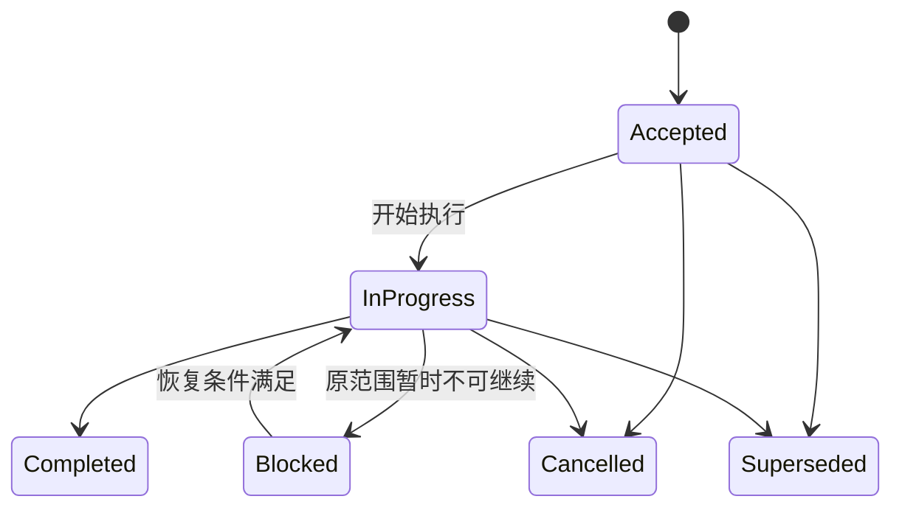

# 任务生命周期

状态：Current
最后更新：2026-07-29
治理对象：任务分类、计划准入、tracker 状态、实施门禁与关闭交付
依据 ADR：`docs/adr/0014-risk-based-plan-lifecycle.md`、`docs/adr/0015-standards-as-governance-source.md`
关联测试：`tests/test_plan_governance.py`

## 目的与边界

本标准规定工作何时需要计划、如何按风险分类、计划如何流转，以及任务何时可以关闭。设计契约
查 `docs/design/`，决策准入查 [ADR 治理](adr-governance.md)，文档归档查
[文档规范](documentation.md)，可复制命令查[开发指南](../guides/development.md)。

## 强制规则

### 任务分类

| 类型 | 适用工作 | 必须门禁 |
| --- | --- | --- |
| A 文档/低风险维护 | 中文说明、链接、无行为重命名 | 文档审阅、定向检查。 |
| B 确定性实现 | 状态机、API、迁移代码、重构 | 设计/ADR、测试设计、实现、分层测试。 |
| C 实验性决策 | 模型、提示词、解析路由 | 冻结实验、评分、ADR，再进入 B。 |
| D 发布/数据操作 | 标签、Release、部署、受保护环境、正式迁移或数据变更 | 备份/回滚、全量门禁、人工复核。 |

普通分支或 `main` 的源码提交与推送是原任务的交付步骤，不单独建立 D 类计划。创建或移动标签、
GitHub Release、部署、受保护环境变更、正式数据操作和需要独立回滚的发布动作必须使用 D 类计划。

### 计划准入与分拆

- B、C、D 类必须在 `docs/plans/` 建立独立计划。跨模块、跨会话或需要显式回滚的非平凡 A 类也
  必须建立计划；简单措辞、链接和局部无行为修正由差异、验证与提交记录承接。
- 每份计划只有一个 `任务类型`。C 输出冻结实验、报告和决策 ADR；B 实现已接受的确定性契约；
  D 执行已经通过实现门禁的发布或真实操作。三类分别关闭。
- backlog 只保存尚未具备计划条件的候选工作。范围、前置条件、验证和成功标准明确后转为
  Accepted 计划，并从 backlog 移除；缺陷证据可继续保留在 regressions，由计划引用。

### 计划契约与状态

活跃计划必须声明 `状态`、`任务类型`、`最后更新`、`关联 ADR`、`关联设计`、`关联 Tracker` 和
`归档判定`，并包含目标与成功标准、范围与非目标、前置条件、工作项、验证与验收、回滚、关闭与
归档。Blocked 计划还必须写阻塞证据、恢复条件、责任位置和复核触发点。

计划只使用以下状态：

`Accepted`、`In Progress`、`Blocked` 可留在活跃 Plans；`Completed`、`Cancelled`、`Superseded`
是终态。终态另写 `关闭结果：Achieved | Rejected | Partial | Not Applicable`。需要新候选、重新
设计或新 ADR 时应关闭旧计划并返回 backlog，不得长期维持不可恢复的 Blocked。

### 状态导航

- 计划正文是状态事实源；`plans/index.md` 只汇总全部活跃计划的状态、类型和下一条件。
- `trackers/current.md` 只镜像全部 In Progress 计划；没有执行中计划时明确写空。
- 计划不复制通用命令、设计正文、实验结果或逐日工作日志，只链接对应事实源。

## 执行与门禁

- 计划实施前必须声明定向测试、适用回归或端到端样本，以及不能自动化的人工验收和责任位置。
- 共享模型、状态机、路由或跨领域流程变更必须追加全量回归；阶段关闭追加固定样本端到端验收。
- 测试使用隔离数据和假外部供应商；外部模型质量必须通过冻结评测回答，不能用单元测试替代。
- 可复现失败登记 regressions 并补回归测试；外部依赖失败保存证据、恢复条件和责任位置。
- 关闭计划按[文档规范](documentation.md#归档与删除)执行 `Retain` 或 `Delete`；自动规则由
  `tests/test_plan_governance.py` 守护，适用命令只在开发指南维护。

## 变更与取代

改变任务类型、计划准入、状态、tracker 事实边界或关闭门禁时必须先新增 ADR。措辞、链接和不
改变语义的流程整理可直接修改本标准。标准保持稳定文件名；旧规则由 ADR 和 Git 历史恢复，不在
standards 内保存版本副本。
