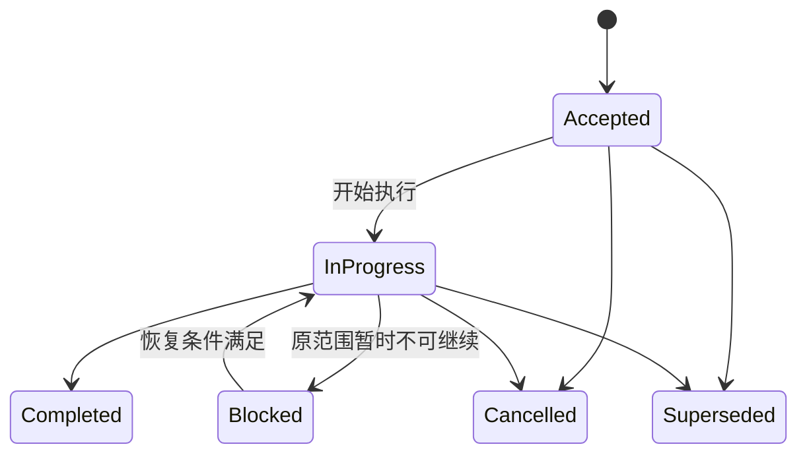

# 任务生命周期

状态：Current  
最后更新：2026-07-29

## 变更分类

| 类型 | 示例 | 必须门禁 |
| --- | --- | --- |
| A 文档/低风险维护 | 中文说明、链接、无行为重命名 | 文档审阅、定向检查。 |
| B 确定性实现 | 状态机、API、迁移、重构 | 设计/ADR、测试设计、实现、分层测试。 |
| C 实验性决策 | 模型、提示词、解析路由 | 冻结实验、评分、ADR，再进入 B。 |
| D 发布/数据操作 | 数据重建、正式发布、远端推送 | 备份/回滚、全量门禁、人工复核。 |

不是所有任务都需要实验。只有结果依赖外部模型质量或存在不可由确定性测试回答的方案取舍时，
才进入实验阶段。

## 计划准入与分拆

- B、C、D 类任务必须在 `docs/plans/` 建立独立计划。跨模块、跨会话或需要显式回滚的非平凡 A
  类也必须建立计划；简单链接、措辞或局部无行为修正只由差异、验证和提交记录承接。
- 每份计划只有一个 `任务类型`。C 类计划输出冻结实验、报告和决策 ADR；B 类计划在决定接受后
  实现确定性契约；D 类计划在实现门禁通过后执行发布或真实数据操作。三类计划分别关闭。
- backlog 只有在范围、前置条件、验证和完成条件已经明确时才能转为 Accepted 计划。转入后不在
  backlog 重复维护；缺陷证据仍可保留在 regressions，并由计划链接。

## 计划状态

计划使用单一 `状态`，正文是唯一事实源：

- `Accepted` 表示范围和门禁已批准但尚未执行；`In Progress` 表示正在执行；`Blocked` 表示同一
  范围可在明确条件满足后恢复。
- `Completed`、`Cancelled`、`Superseded` 是终态，不得留在活跃 Plans。终态另写 `关闭结果`：
  `Achieved`、`Rejected`、`Partial` 或 `Not Applicable`；Completed 不等于方案被采纳。
- Blocked 计划必须包含阻塞证据、恢复条件、责任位置和复核触发点。需要新候选、重新设计或新
  ADR 时不能继续 Blocked，应关闭旧计划并把新工作返回 backlog。

## 计划正文与状态导航

活跃计划必须声明 `状态`、`任务类型`、`最后更新`、`关联 ADR`、`关联设计`、`关联 Tracker` 和
`归档判定`，并包含目标与成功标准、范围与非目标、前置条件、工作项、验证与验收、回滚、关闭与
归档。Blocked 计划追加“阻塞与恢复”。

- `plans/index.md` 只汇总全部 Accepted、In Progress 和 Blocked 计划的状态、类型和下一条件。
- `trackers/current.md` 只镜像全部 In Progress 计划；没有执行中计划时明确写空。
- 计划不复制通用命令、设计正文、实验结果或逐日工作日志，只链接相应指南、设计、报告和 tracker。

## 流程

## 阶段门槛

| 阶段 | 必须产物 | 退出条件 |
| --- | --- | --- |
| 讨论 | 设计或 ADR | 当前事实、范围、接口、风险、兼容与回滚明确。 |
| 实验（可选） | manifest、结果、报告 | 固定样本、预算、评分量表和采纳门槛均已执行。 |
| 决策 | ADR | 明确采纳或拒绝，并链接实验报告。 |
| 实施 | 计划与测试设计 | 变更范围、回滚方式、测试命令和完成条件明确。 |
| 关闭 | 测试结果、映射与任务记录 | 适用门禁通过，失败已沉淀，提交可独立回滚。 |

## 测试与关闭规则

- 每个计划在实施前声明定向测试、适用回归或端到端样本，以及不能自动化的人工验收。
- 文档与代码追溯、架构和设计变更分别执行对应语义门禁；具体触发项以
  [代码与文档追溯规范](code-document-traceability.md)为准。
- 修改共享模型、状态机、路由或跨领域流程时必须追加全量回归；阶段关闭时追加固定样本端到端
  验收。当前可复制命令只在[开发指南](../guides/development.md)维护。
- 测试使用隔离数据和假外部供应商；外部模型质量必须通过冻结评测回答，不能用单元测试替代。
- 可复现失败登记到 regressions 并补充回归测试；外部依赖失败保存证据、恢复条件和责任位置。
- 关闭计划必须按 [ADR 0013](../adr/0013-selective-history-retention.md) 声明 `Retain` 或 `Delete`。
  只有已执行 D 类操作、迁移/发布里程碑、事故复盘或不可替代外部证据进入 History；其他计划在
  当前事实与 Git 提交形成后删除。

主链重构只可在数据契约和解析路由 ADR 接受后开始。当前 v0.1 主链作为历史基线，
不承担向新架构提供长期兼容的责任。
