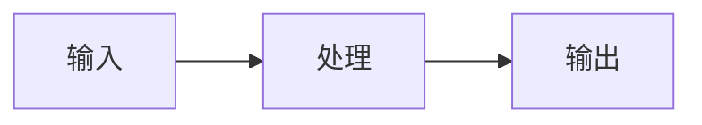

# 设计标题

设计状态：Draft
实现状态：Not Started
最后更新：YYYY-MM-DD
关联代码：尚未实现
关联测试：尚未实现
关联 ADR：尚未决定

## 目标与边界

## 流程

```mermaid
flowchart LR
    INPUT[输入] --> PROCESS[处理] --> OUTPUT[输出]
```

## 接口与数据

## 状态与失败语义

## 符合度与验收
