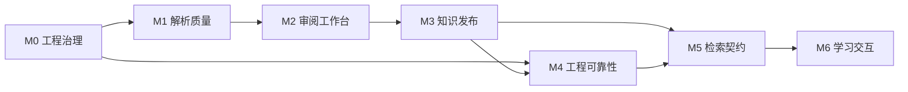

# 能力路线图

状态：Current
最后更新：2026-07-29

本文件只描述长期能力依赖和退出条件，不保存任务进度。当前工作查 [todo](todo.md)，关闭证据查
[completed](completed.md)；关联任务 ID 必须存在于其中一张台账。

| 里程碑 | 能力目标 | 前置里程碑 | 退出能力 | 关联任务 |
| --- | --- | --- | --- | --- |
| M0 | 工程治理 | — | 文档、标准、ADR、计划和自动门禁具有单一事实源。 | DOC-001、DOC-002 |
| M1 | 解析质量 | M0 | 候选路线按冻结样本评测，结果经 ADR 决定并形成质量回归。 | EXP-001、EXP-002、EXP-003、QA-001 |
| M2 | 审阅工作台 | M1 | 页图、OCR、来源证据、运行版本和人工结论可逐页对照。 | BASE-004、DES-001 |
| M3 | 知识发布 | M2 | 候选、工作簿、关系和发布版本能完整回链原始证据。 | DES-002 |
| M4 | 工程可靠性 | M0、M3 | 包边界、任务恢复、CI、部署、访问控制与备份恢复可验证。 | BASE-003、REL-001、REG-001、ENG-001、ARCH-001、OPS-001、JOB-001 |
| M5 | 检索契约 | M3、M4 | 只索引已发布版本，查询结果包含版本和原始证据引用。 | RET-001 |
| M6 | 学习交互 | M5 | 对话、图片问答、练习、会话和进度只消费可追溯检索结果。 | PRD-001 |

新长期能力先扩展本表；形成可执行问题后使用稳定任务 ID 进入 todo。需要长期决定或接口契约时再
进入 ADR/Design，具备范围、验证和回滚后建立 Plan。关闭时从 todo 原子迁移到 completed，路线图
不写完成状态。
