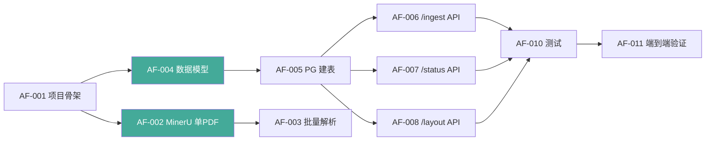

# Axiom-Flow 任务清单

## Phase 1：MinerU 集成（当前阶段）

任务依赖关系：

> 蓝色节点 = 可并行开发；箭头 = 前置依赖

| ID | 类型 | 描述 | 前置依赖 | 状态 | 备注 |
|----|------|------|---------|------|------|
| AF-001 | 基础设施 | 项目骨架搭建：app/ 目录结构 + 配置系统 | — | ✅ | 已完结 |
| AF-002 | 服务 | MinerUService 实现：单 PDF 解析 + 布局提取 | AF-001 | ✅ | 已完结（GPU 1.47页/秒） |
| AF-003 | 服务 | MinerUService 批量解析支持 | AF-002 | ✅ | `parse_pdf_batch()` 已实现 |
| AF-004 | 模型 | Document / LayoutBlock 数据模型 | AF-001 | ✅ | 已完结 |
| AF-005 | 存储 | PostgreSQL 建表 + LayoutRepo + DocumentRepo | AF-004 | ✅ | 已完结 |
| AF-006 | API | POST /ingest 端点（异步解析） | AF-002, AF-005 | ✅ | 含 background task |
| AF-007 | API | GET /status 端点（进度查询） | AF-005 | ✅ | |
| AF-008 | API | GET /layout 端点（布局回溯） | AF-005 | ✅ | |
| AF-009 | 工具 | data/parsed 输出目录规范与验证 | AF-003 | ✅ | 已通过实际解析验证 |
| AF-010 | 测试 | MinerUService 单元测试 + 集成测试 | AF-006, AF-007, AF-008 | 🔲 | 详见 `docs/tests.md` |
| AF-011 | 验证 | 对 1 本实际数学教材进行端到端解析验证 | AF-010 | ✅ | 线性代数 341页 7k+块 2.6k公式已验证 |

## Phase 2：LlamaIndex 知识索引（后续）

| ID | 类型 | 描述 | 优先级 |
|----|------|------|--------|
| AF-101 | 服务 | NodeParser：Markdown → AxiomNode 转换 | P1 |
| AF-102 | 服务 | GraphBuilder：PropertyGraph 逻辑依赖链接 | P1 |
| AF-103 | 服务 | IndexManager：Qdrant 向量索引构建 | P1 |
| AF-104 | API | GET /query 语义检索端点 | P1 |
| AF-105 | 测试 | 端到端检索测试 | P1 |

## Phase 3：任务队列与批量处理（后续）

| ID | 类型 | 描述 | 优先级 |
|----|------|------|--------|
| AF-201 | 服务 | Redis + Celery 异步任务队列 | P2 |
| AF-202 | 脚本 | 批量解析 cli 入口 | P2 |
| AF-203 | 优化 | 增量索引与增量更新 | P2 |
